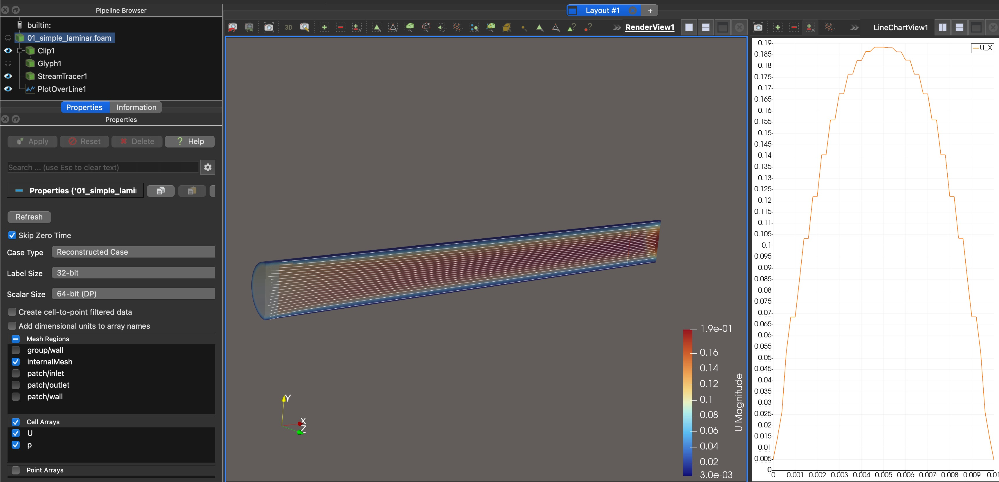

# Rheology Simulation of Vein Grafts

This repository contains OpenFOAM simulation experiments for studying laminar blood flow in vascular structures, with a focus on vessel junctions and venous graft optimization.

---

## Research Problem

During tissue transplantation or vessel repair surgery, two vessels with radii **r1** and **r2** must be sutured end-to-end. When the ratio **r1/r2 > 3/2** (or **< 2/3**), a venous graft segment must be inserted between them as an intermediate bridge.

**Research Question:** Given variable r1/r2 ratios and venous graft length (L), how do we preserve laminar blood flow through the junction?

```
Donor Artery          Recipient Artery
    [r1] ──────────────────── [r2]
                ↑
         Venous Graft [r3, L]
         (inserted when r1/r2 > 3/2 or < 2/3)
```

---

## Prerequisites

### 1. Clone the Repository

#### 1a. Install Git

**macOS:**
```bash
# Git is bundled with Xcode Command Line Tools
xcode-select --install
```
Verify:
```bash
git --version
```

#### 1b. Configure Git (first-time setup)

```bash
git config --global user.name "Your Name"
git config --global user.email "your@email.com"
```

#### 1c. Clone or Update the Repository

**First time — clone the repository:**
```bash
git clone https://github.com/emredagli/Rheology-Simulation-of-Vein-Grafts "$HOME/Rheology-Simulation-of-Vein-Grafts"
```

**Already cloned — get the latest changes:**
```bash
cd "$HOME/Rheology-Simulation-of-Vein-Grafts"
git pull
```

### 2. Docker

Install Docker Desktop for Mac:
- https://docs.docker.com/desktop/setup/install/mac-install/

Verify installation:
```bash
docker --version
docker info
```

### 3. Pull the OpenFOAM v2512 Image

```bash
docker pull opencfd/openfoam-default:2512
```

### 4. Create the Run Folder

```bash
mkdir -p "$HOME/Rheology-Simulation-of-Vein-Grafts/run"
```

- **`experiments/`** — OpenFOAM case definition files (geometry, mesh, boundary conditions, solver settings) — cloned from the repository
- **`run/`** — OpenFOAM solver output and results (created locally, not tracked in git)

### 5. Start the Docker Container

**Apple Silicon (M1/M2/M3):**
```bash
docker run -it --rm \
  -v "$HOME/Rheology-Simulation-of-Vein-Grafts":/work \
  opencfd/openfoam-default:2512
```

**Intel Mac (or if architecture issues arise):**
```bash
docker run -it --rm --platform=linux/amd64 \
  -v "$HOME/Rheology-Simulation-of-Vein-Grafts":/work \
  opencfd/openfoam-default:2512
```

Once inside the container, verify OpenFOAM is loaded:
```bash
foamVersion
```

### 6. ParaView (Visualization)

Install ParaView on macOS for result visualization:
- Download: https://www.paraview.org/download/
- Install the appropriate `.pkg` file (e.g., `ParaView-6.1.0-RC1-MPI-OSX11.0-Python3.12-arm64.pkg`)
- Documentation: https://docs.paraview.org/en/latest/UsersGuide/index.html

---

## Repository Structure

```
~/Rheology-Simulation-of-Vein-Grafts/
├── experiments/           # Case definition files (tracked in this repo)
│   ├── 01_simple_laminar/
│   ├── 02_heartbeat_laminar/
│   ├── 03_elastic_vessel/
│   ├── 04_vessel_junction/
│   ├── 05_venous_graft/
│   ├── 06_graft_length_study/
│   └── 07_graft_radius_study/
└── run/                   # Solver outputs (NOT tracked — results only)
    ├── 01_simple_laminar/
    ├── 02_heartbeat_laminar/
    └── ...
```

Each experiment folder under `experiments/` follows the standard OpenFOAM case structure:

```
<case>/
├── 0/                    # Initial & boundary conditions
│   ├── U                 # Velocity field
│   └── p                 # Pressure field
├── constant/
│   ├── transportProperties
│   └── polyMesh/         # Mesh definition (generated by blockMesh)
└── system/
    ├── blockMeshDict     # Geometry and mesh specification
    ├── controlDict       # Simulation time and output settings
    ├── fvSchemes         # Numerical schemes
    └── fvSolution        # Linear solver settings
```

---

## Experiments

### Experiment 01 — Simple Laminar Flow in a Straight Tube

**Goal:** Establish a baseline simulation of steady laminar (Poiseuille) flow through a straight cylindrical vessel at constant inlet velocity.

**Key Parameters:**
- Tube radius: `r = 0.005 m` (5 mm, representative arterial scale)
- Tube length: `L = 0.1 m`
- Inlet velocity: `U = 0.1 m/s` (constant)
- Blood viscosity: `ν = 3.3e-6 m²/s`
- Expected Reynolds number: `Re = U·(2r)/ν ≈ 303` (well within laminar regime, Re < 2300)

**Solver:** `icoFoam` (incompressible, laminar, transient)

**Mesh approach:** Full 3D cylinder — O-grid (butterfly) mesh with 5 hex blocks: 1 square centre block + 4 outer blocks with circular arc edges. Both walls included directly. Radial grading 4:1 toward the wall for better boundary resolution. Total: ~25,000 cells (12×12×40 centre + 4×10×12×40 outer).

**Run time:** 10 s — exceeds the viscous diffusion time scale (r²/ν ≈ 7.6 s), ensuring the fully developed parabolic profile is reached everywhere in the tube.

**Validation:** Verify parabolic velocity profile at the outlet (Hagen-Poiseuille solution).

**Files location:** `experiments/01_simple_laminar/`

**To run:**
```bash
# Inside Docker container
cp -r /work/experiments/01_simple_laminar /work/run/
cd /work/run/01_simple_laminar
blockMesh
checkMesh
icoFoam
touch 01_simple_laminar.foam   # For ParaView
```

#### Visualising in ParaView — step by step

##### Step 1 — Open the case
1. On macOS (outside Docker), open ParaView.
2. **File → Open** → navigate to `~/Rheology-Simulation-of-Vein-Grafts/run/01_simple_laminar/`.
3. Select `01_simple_laminar.foam` → **OK** → click **Apply**.
   You will see a full 3D cylinder in the viewport.

##### Step 2 — Go to the last time step
1. Click the **⏭ Last Frame** button in the toolbar to jump to t = 10 s (fully developed flow).

##### Step 3 — Colour by axial velocity
1. Change the field dropdown from `p` to **U**, component **X**.
2. Click **Rescale** (colorbar icon) to fit the range.
   You will see **blue at the wall** (U = 0, no-slip) grading to **red at the centre** (peak ≈ 0.2 m/s).

##### Step 4 — Clip the cylinder to see inside
1. Select `01_simple_laminar.foam` in the Pipeline Browser.
2. **Filters → Search** (or press **Space**) → type `Clip` → select **Clip** → **Apply**.
   Set **Normal = (0, 0, 1)**, **Origin = (0, 0, 0)** to remove the top half.
   You will see the inside of the cylinder coloured by velocity.

##### Step 5 — Slice down the middle to see the full profile
1. Select `01_simple_laminar.foam` in the Pipeline Browser.
2. **Filters → Search** → type `Slice` → select **Slice** → **Apply**.
   Set **Normal = (0, 0, 1)**, **Origin = (0, 0, 0)**.
   Colour by **U → X** and press **F** to fit the view.
   You will see the parabolic colour gradient: blue at both walls (U = 0), red at the centreline (U ≈ 0.2 m/s).
   > **Note:** The parabola is shown as a colour gradient on the slice surface, not as a drawn curve.

##### Step 6 — Verify the parabolic profile numerically (Plot Over Line)
1. Select `01_simple_laminar.foam` in the Pipeline Browser (important: select the source, not Clip or Slice).
2. **Filters → Search** → type `Plot Over Line` → select it → **Apply**.
   Set:
   - **Point 1**: `(0.09, -0.005, 0)` — near outlet, bottom wall
   - **Point 2**: `(0.09,  0.005, 0)` — near outlet, top wall
3. A **LineChartView** opens on the right. In the chart series list, **uncheck everything except `U_X`**.
   You should see a smooth parabola: zero at both walls (y = ±0.005), peak ≈ 0.2 m/s at the centre (y = 0).

##### Step 7 — Streamlines (standard method for all experiments)

Streamlines are the primary visualization tool across all experiments. They naturally reveal recirculation zones, flow separation, and secondary flows in later experiments (junctions, grafts).

1. Select `01_simple_laminar.foam` in the Pipeline Browser.
2. **Filters → Search** → type `Stream Tracer` → select it.
3. Set in Properties:
   - **Vectors**: `U`
   - **Seed Type**: `Line Source`
   - **Point 1**: `(0.001, -0.004, 0)` — near inlet, close to wall
   - **Point 2**: `(0.001,  0.004, 0)` — near inlet, opposite side
   - **Resolution**: `20`
   - **Max Streamline Length**: `0.2`
4. Click **Apply** → colour by **U → Magnitude**.

In a straight tube the streamlines will be straight and parallel. In future junction and graft experiments the same setup will automatically reveal recirculation zones and spiral flows.

##### Step 8 — Velocity arrows on a cross-section (Glyph)

1. Select `Slice1` in the Pipeline Browser.
2. **Filters → Search** → type `Glyph` → select it.
3. Set:
   - **Glyph Type**: `Arrow`
   - **Orientation Array**: `U`
   - **Scale Array**: `U`
   - **Scale Factor**: `0.02`
   - **Glyph Mode**: `Every Nth Point`, N = `2`
4. Click **Apply**.
   Arrows show longer in the centre (fast) and shorter/zero at the walls.

**Expected result:**

| Quantity | Expected value |
|---|---|
| Peak (centreline) velocity | ≈ 0.20 m/s (= 2 × U_inlet) |
| Wall velocity | 0 m/s (no-slip) |
| Profile shape | Parabola (Hagen-Poiseuille) |
| Reynolds number | ≈ 303 (laminar ✓) |

**ParaView screenshot:**




> **One-click ParaView macro (recommended shortcut)**
>
> Instead of following the manual steps above on each time, you can run the pre-built visualisation script as a ParaView macro:
>
> 1. Open `assets/paraview/standard_viz.py` in a text editor and set `CASE_DIR` and `RADIUS` in the *"Macro defaults"* section at the top.
> 2. Open ParaView GUI.
> 3. **Tools → Macros → Add new macro** → select `assets/paraview/standard_viz.py` → **OK**.
> 4. Click the macro from the **Macros** menu.
>
> The macro builds the full pipeline automatically (Clip, Slice, StreamTracer, Glyph, Plot Over Line) and displays all views inside ParaView. To switch cases, update `CASE_DIR` in the file and re-run.

---

### Experiment 02 — Laminar Flow with Simulated Heartbeat

**Goal:** Replace the constant inlet velocity with a pulsatile waveform that approximates a realistic cardiac cycle (heart rate ~70 bpm → period T = 0.857 s).

**Key Parameters:**
- Same geometry as Experiment 01
- Inlet boundary condition: time-varying velocity using a `codedFixedValue` or `uniformFixedValue` with waveform data
- Waveform: simplified sinusoidal or lookup-table based on a physiological flow curve
    - Peak systolic velocity: `U_max ≈ 0.5 m/s`
    - End-diastolic velocity: `U_min ≈ 0.05 m/s`
- Simulation duration: minimum 3 cardiac cycles to reach periodic steady state

**Solver:** `icoFoam`

**New/Modified Files vs. Experiment 01:**
- `0/U` — updated with pulsatile inlet profile
- `system/controlDict` — updated `endTime` and `deltaT` for time-accurate simulation

**Files location:** `experiments/02_heartbeat_laminar/`

---

### Experiment 03 — Heartbeat Flow with Elastic Vessel Wall (FSI)

**Goal:** Account for the natural compliance of blood vessel walls. Unlike rigid-wall simulations, an elastic vessel expands and contracts with each pulse, significantly affecting flow patterns and wall shear stress.

**Approach:** Fluid-Structure Interaction (FSI) using OpenFOAM's `solidDisplacementFoam` or coupling with `solids4foam` library.

**Key Parameters:**
- Vessel wall thickness: `t_wall = 0.001 m` (1 mm)
- Wall material: linear elastic, Young's modulus `E ≈ 0.5–1.0 MPa` (arterial tissue range)
- Poisson's ratio: `ν_s ≈ 0.45` (nearly incompressible)
- Pulsatile inlet: same waveform as Experiment 02

**Additional Files vs. Experiment 02:**
- `constant/solidProperties` — wall material definition
- Separate fluid and solid mesh regions in `constant/`
- `system/fvSolution` — updated for coupled FSI solver

**Note:** This experiment is significantly more complex. A simplified approach using a moving-wall boundary (`movingWallVelocity`) may be used as an intermediate step before full FSI.

**Files location:** `experiments/03_elastic_vessel/`

---

### Experiment 04 — Heartbeat Flow Through a Vessel Junction (No Graft)

**Goal:** Simulate pulsatile flow through a direct end-to-end anastomosis of two vessels with different radii, without a venous graft. Identify the flow disturbances (recirculation zones, turbulence onset) that occur when the r1/r2 ratio exceeds the clinical threshold.

**Key Parameters:**
- Donor vessel radius: `r1 = 0.005 m`
- Recipient vessel radius: `r2 = 0.003 m` → ratio `r1/r2 ≈ 1.67 > 3/2`
- Junction type: abrupt step transition (direct suture model)
- Pulsatile inlet: same waveform as Experiment 02

**Outputs to Analyze:**
- Velocity field at and downstream of the junction
- Wall shear stress (WSS) distribution
- Presence and extent of recirculation zones
- Local Reynolds number at the junction

**Files location:** `experiments/04_vessel_junction/`

---

### Experiment 05 — Heartbeat Flow with Venous Graft at Junction

**Goal:** Insert a venous graft segment (radius `r3`, length `L`) between the donor and recipient vessels. Compare flow quality against Experiment 04 to quantify the improvement in laminar flow preservation.

**Key Parameters:**
- Donor vessel radius: `r1 = 0.005 m`
- Recipient vessel radius: `r2 = 0.003 m`
- Graft radius: `r3 = 0.004 m` (intermediate value, `r1 > r3 > r2`)
- Graft length: `L = 0.02 m` (baseline, 20 mm)
- Two junctions: donor→graft and graft→recipient
- Pulsatile inlet: same waveform as Experiment 02
- **Venous graft wall elasticity:** distinct from the native arterial vessels — venous wall is thinner and more compliant (lower Young's modulus, ~0.1–0.3 MPa vs. ~0.5–1.0 MPa for arteries), which must be accounted for in the wall boundary conditions

**Geometry:**
```
[r1=5mm] ──── [r3=4mm, L=20mm] ──── [r2=3mm]
         step1                step2
```

**Success Criteria:** Absence of sustained recirculation zones; WSS within physiological range (0.5–4.0 Pa).

**Files location:** `experiments/05_venous_graft/`

---

### Experiment 06 — Parametric Study: Venous Graft Length

**Goal:** Using the configuration from Experiment 05, vary the graft length `L` to determine the optimal length that best preserves laminar flow at both junctions.

**Parameter Sweep:**

| Case | Graft Length L |
|------|---------------|
| 06a  | 5 mm          |
| 06b  | 10 mm         |
| 06c  | 20 mm         |
| 06d  | 40 mm         |
| 06e  | 80 mm         |

All other parameters remain identical to Experiment 05 (`r1=5mm`, `r2=3mm`, `r3=4mm`).

**Files location:** `experiments/06_graft_length_study/`

Structure:
```
experiments/06_graft_length_study/
├── base/          # Shared template (copy and modify L in blockMeshDict)
├── 06a_L05mm/
├── 06b_L10mm/
├── 06c_L20mm/
├── 06d_L40mm/
└── 06e_L80mm/
```

**Key Metric:** Reattachment length of any recirculation zone normalized by graft length.

---

### Experiment 07 — Parametric Study: Venous Graft Radius

**Goal:** Using the baseline graft length from Experiment 06, vary the graft radius `r3` to find the optimal intermediate radius that minimizes flow disturbance at both step transitions.

**Parameter Sweep:**

| Case | Graft Radius r3 | r1/r3 ratio | r3/r2 ratio |
|------|----------------|-------------|-------------|
| 07a  | 3.0 mm         | 1.67        | 1.00        |
| 07b  | 3.5 mm         | 1.43        | 1.17        |
| 07c  | 4.0 mm         | 1.25        | 1.33        |
| 07d  | 4.5 mm         | 1.11        | 1.50        |
| 07e  | 5.0 mm         | 1.00        | 1.67        |

All other parameters remain identical to the best-performing length from Experiment 06 (`r1=5mm`, `r2=3mm`).

**Files location:** `experiments/07_graft_radius_study/`

Structure:
```
experiments/07_graft_radius_study/
├── base/          # Shared template (copy and modify r3 in blockMeshDict)
├── 07a_r3_3.0mm/
├── 07b_r3_3.5mm/
├── 07c_r3_4.0mm/
├── 07d_r3_4.5mm/
└── 07e_r3_5.0mm/
```

**Key Metric:** Maximum WSS at each step junction and minimum velocity in recirculation zones.

---

## Blood Flow Parameters Reference

These physiological values should be used consistently across all experiments:

| Parameter | Value | Unit | Notes |
|-----------|-------|------|-------|
| Blood density | 1060 | kg/m³ | |
| Dynamic viscosity | 0.0035 | Pa·s | At 37°C |
| Kinematic viscosity | 3.3×10⁻⁶ | m²/s | `ν = μ/ρ` |
| Heart rate | 70 | bpm | T = 0.857 s |
| Peak systolic velocity | ~0.5 | m/s | Arterial |
| End-diastolic velocity | ~0.05 | m/s | Arterial |
| Physiological WSS range | 0.5–4.0 | Pa | Healthy range |
| Laminar Re threshold | < 2300 | — | For pipe flow |

---

## Running Experiments — General Workflow

```bash
# 1. Start Docker container
docker run -it --rm \
  -v "$HOME/Rheology-Simulation-of-Vein-Grafts":/work \
  opencfd/openfoam-default:2512

# 2. Copy experiment to run folder
cp -r /work/experiments/<experiment_name> /work/run/

# 3. Navigate to run folder
cd /work/run/<experiment_name>

# 4. Generate mesh
blockMesh

# 5. (Optional) Check mesh quality
checkMesh

# 6. Run solver
icoFoam          # For most laminar experiments
# or
pimpleFoam       # For FSI / more complex cases (Experiment 03)

# 7. Create ParaView entry file
touch <experiment_name>.foam
```

Then open `~/Rheology-Simulation-of-Vein-Grafts/run/<experiment_name>/` in ParaView on macOS.

---

## Viewing Results in ParaView

1. Launch ParaView from Applications
2. File → Open → navigate to `~/Rheology-Simulation-of-Vein-Grafts/run/<experiment_name>/`
3. Select `<experiment_name>.foam` and click **Open**
4. In the Properties panel, click **Apply**
5. Use the toolbar to select fields to visualize: `U` (velocity), `p` (pressure), `wallShearStress`

Useful filters for vascular flow analysis:
- **StreamTracer** — visualize streamlines and identify recirculation
- **Glyph** — velocity vectors
- **Plot Over Line** — extract velocity profile at a cross-section
- **Calculator** — compute derived quantities (e.g., WSS magnitude)

---

## References

- OpenFOAM Documentation: https://www.openfoam.com/
- OpenFOAM Repository: https://gitlab.com/openfoam/core/openfoam
- ParaView User's Guide: https://docs.paraview.org/en/latest/UsersGuide/index.html
- OpenStreetMap Features: https://wiki.openstreetmap.org/wiki/Map_features