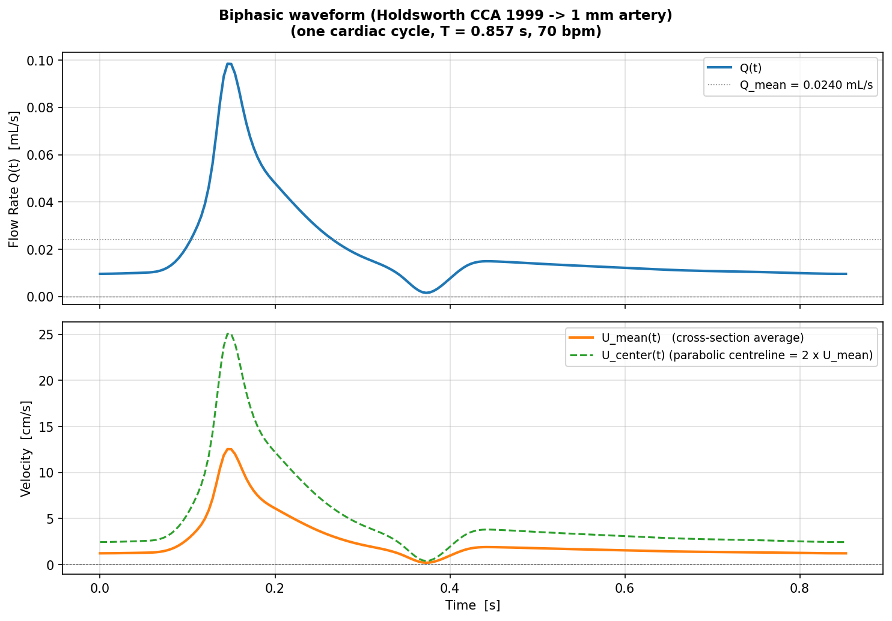
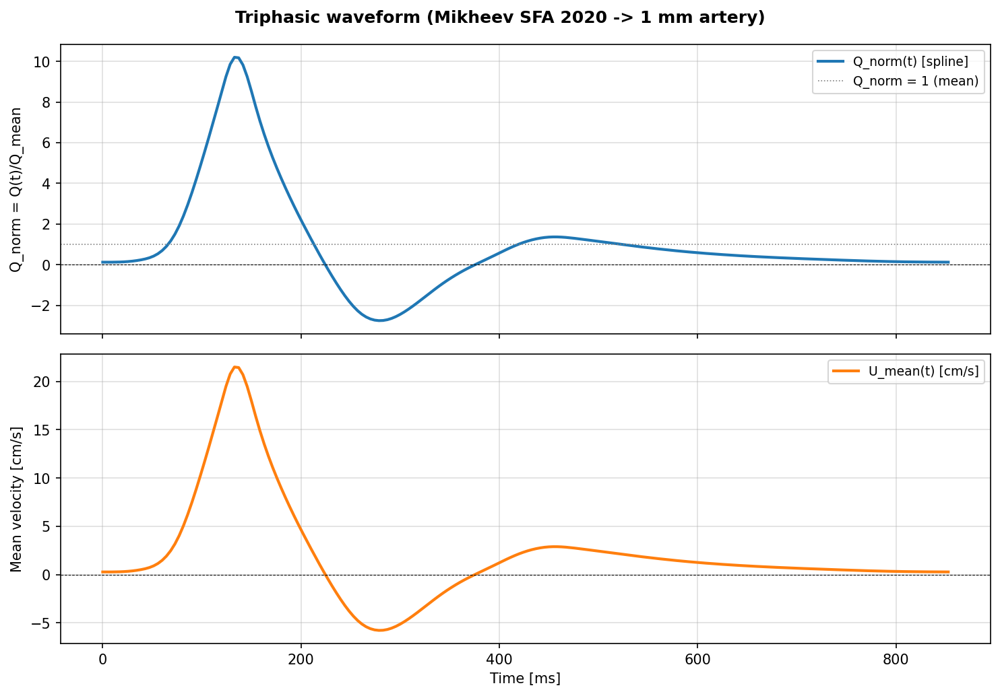
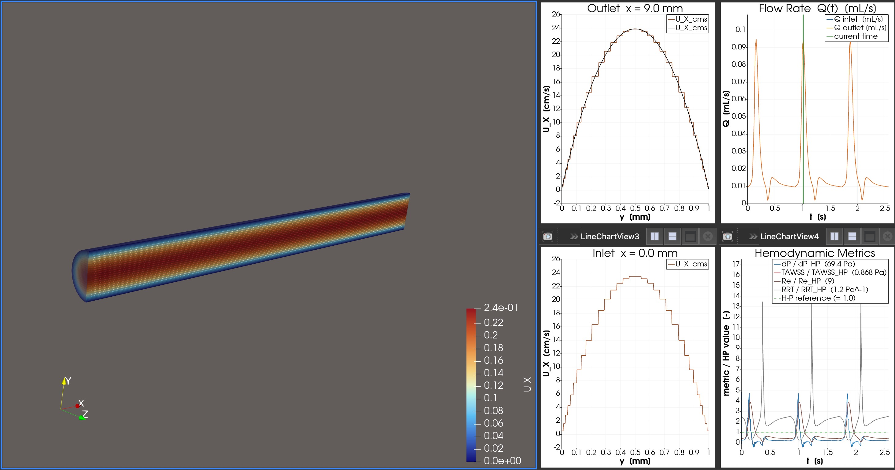
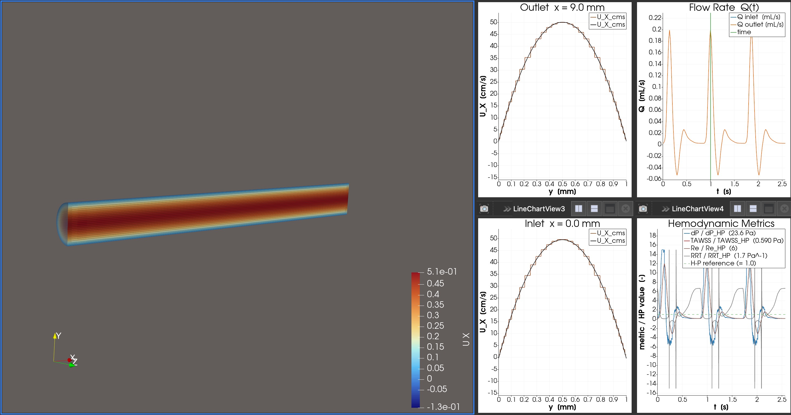

# Vascular Anastomosis Hemodynamics — OpenFOAM Simulation

This repository contains OpenFOAM simulation experiments for studying laminar blood flow
in vascular structures, with a focus on vessel junctions and venous graft optimization,
and minimising the risk of thrombosis (blood clot formation) at the anastomosis site.

---

## Research Problem

During tissue transplantation or vessel repair surgery, two vessels with radii **r1** and
**r2** must be sutured end-to-end. When the ratio **r1/r2 > 3/2** (or **< 2/3**), a
venous graft segment must be inserted between them as an intermediate bridge.

**Research Question:** Given variable r1/r2 ratios and venous graft length L, how do we
preserve laminar blood flow through the junction while minimising thrombosis risk?

```
With venous graft  (r1 → r3 → r2, each step ratio < 3/2)

               blood flow ────────────────────────────►

  ━━━━━━━━━━━━━━━━━━━━━━━━┓       ┏━━━━━━━━━━━━━━━━━━━━━━━━━━━━━┓       ┏━━━━━━━━━━
                          ┃       ┃                             ┃       ┃
     Donor (r1 = 5 mm)    ┃ ────► ┃     Venous graft (r3, L)    ┃ ────► ┃  Recipient
                          ┃       ┃          (r3 = 4 mm)        ┃       ┃  (r2 = 3 mm)
  ━━━━━━━━━━━━━━━━━━━━━━━━┛       ┗━━━━━━━━━━━━━━━━━━━━━━━━━━━━━┛       ┗━━━━━━━━━━
                              ↑                                     ↑
                           step 1                                step 2
                      (r1/r3 = 1.25 ✓)                      (r3/r2 = 1.33 ✓)

  Research goal: find optimal graft length L that minimises thrombosis risk (RRT)
```

---

## Prerequisites

- [Docker Desktop](https://www.docker.com/products/docker-desktop/) or a native
  OpenFOAM v2412+ installation
- Docker image: `opencfd/openfoam-default:2512`
- [ParaView](https://www.paraview.org/) 5.x or later (for visualisation)

---

## Repository Structure

```
.
├── experiments/          # OpenFOAM case definition files (tracked in git)
│   ├── 01_simple_laminar/
│   ├── 02_biphasic_heartbeat/
│   ├── 03_triphasic_heartbeat/
│   └── 04_vessel_junction/
├── run/                  # Solver outputs (not tracked in git)
├── assets/
│   ├── paraview/         # ParaView Python macros
│   ├── scripts/          # Waveform generation and utility scripts
│   └── img/              # Reference images and waveform plots
├── tmp/                  # Scratch files and screenshots
└── README.md
```

Every experiment folder follows the standard OpenFOAM layout:

```
<case>/
├── 0/                    # Initial & boundary conditions
│   ├── U                 # Velocity field
│   └── p                 # Pressure field
├── constant/
│   ├── transportProperties
│   └── polyMesh/         # Mesh generated by blockMesh
└── system/
    ├── blockMeshDict     # Geometry and mesh specification
    ├── controlDict       # Simulation time and output settings
    ├── fvSchemes         # Numerical schemes
    └── fvSolution        # Linear solver settings
```

---

## Physiological Modeling Approach

### Inlet Boundary Condition

A physiologically realistic inlet uses a **Womersley pulsatile velocity profile** based on
a cardiac waveform (T = 0.857 s, 70 bpm), Fourier-decomposed into N = 20 harmonics:

```
U(r,t) = 2·U₀·(1−η²)  +  Σₙ Re[Ûₙ · W_n(η) · e^(inω₀t)]
```

where η = r/R, Û_n are the complex Fourier amplitudes of U_mean(t), and W_n(η) is the
Womersley shape function for harmonic n (Womersley 1955):

```
Λ_n = R·√(i·n·ω₀/ν),   W_n(η) = [1 − J₀(Λ_n η)/J₀(Λ_n)] / [1 − 2J₁(Λ_n)/(Λ_n J₀(Λ_n))]
```

A simple sinusoidal wave `Q(t) = Q_mean + Q_amp sin(ωt)` is **not physiologically accurate**
because it misses the asymmetric cardiac waveform shape, including the **dicrotic notch** (brief
dip at aortic valve closure), the short systolic peak (~17% of cycle), and the long diastolic
decay. From Experiment 02 onward, the waveform is based on the **Holdsworth et al. (1999)**
archetypal common carotid artery (CCA) waveform — the most widely used reference for
physiological pulsatile-flow simulations:

| Feature | Value (Holdsworth 1999, scaled to 70 bpm) |
|---|---|
| Period T | 0.857 s (70 bpm) |
| Peak systole | U_mean = 0.50 m/s at t = 0.142 s (φ = 0.166T) |
| Dicrotic notch | U_mean ≈ 0.10 m/s at t = 0.372 s (φ = 0.434T) |
| End-diastolic | U_mean = 0.05 m/s |
| Q_peak | ≈ 39.2 mL/s (R = 5 mm) |
| Q_notch | ≈ 7.9 mL/s at t = 0.372 s |
| Q_mean (DC) | ≈ 10.3 mL/s |

For Experiment 01 (baseline) a constant velocity is sufficient. From
Experiment 02 onward the Womersley inlet is applied.

In OpenFOAM this is implemented with:
- `uniformFixedValue` + `table` for a flat-profile pulsatile inlet (simple)
- `codedFixedValue` with precomputed Womersley shape-function lookup tables (Experiments 02+)

The Womersley profile automatically satisfies the no-slip condition at the wall (W_n(1) = 0)
and produces the correct blunt plug profile at high α, including the physiologically important
**near-wall flow reversal ring** during the deceleration phase of diastole.

### Derivation of Q(t) for a 1 mm Artery

A physiologically realistic Q(t) for a 1 mm artery cannot be measured directly (Doppler
resolution limits) but is derived from larger-vessel measurements using Murray's cube law.

**Murray's Law (cube law):**
Murray's law [3] states that for a branching arterial tree under minimum energy conditions:

    Q ∝ r^ξ    where ξ = 3.0 (steady laminar, Murray 1926) or ξ = 2.76 (pulsatile, Olufsen 2000)

This project uses ξ = 3.0 (conservative estimate). The scaling formula is:

    Q_mean(1mm) = Q_mean(ref) × (r_1mm / r_ref)³

**Womersley Number at 1 mm:**

    α = r × √(ω / ν) = 0.0005 × √(2π × 70/60 / 3.3×10⁻⁶) ≈ 0.745

Since α ≪ 2, viscous forces dominate inertia and the velocity profile is parabolic at every
instant (quasi-Poiseuille regime). The full Womersley profile reduces to:

    u(r, t) = 2 × Q(t)/A × (1 − (r/r₀)²)

This is confirmed by Madhavan & Kemmerling (2018) [11]: differences between plug, parabolic,
and Womersley inlet profiles vanish within 1.75 diameters of the inlet.

**Option A — Biphasic (cerebral/carotid territory):**

Source: Holdsworth et al. (1999) [1], common carotid artery (CCA), 17 subjects, 3560 cycles.
- Reference: r_CCA = 3.15 mm, Q_mean = 6.0 mL/s, T = 0.917 s
- Scaled: Q_mean(1mm) = 6.0 × (0.5/3.15)³ = **0.024 mL/s**, T = 0.857 s (70 bpm)
- Waveform shape: biphasic — large systolic peak (Q_peak ≈ 3.93 × Q_mean), brief dicrotic
  notch dip at ~43% of cycle, diastolic decay. No flow reversal.

Physical basis: In small peripheral arteries such as the saphenous artery, McDonald's
*Blood Flow in Arteries* (Chapter 9) explicitly states: *"there is no backflow and the flow
fluctuations are very small"* — attributed to high impedance at low harmonics near the
peripheral reflecting sites. Reymond et al. (2009) [4] confirms that in cerebral and carotid
branches, *"flow is purely unidirectional."*



**Option B — Triphasic (peripheral/femoral territory):**

Source: Mikheev et al. (2020) [2], superficial femoral artery (SFA), physical simulation.
- Reference: r_SFA = 2.5 mm, Q_mean = 2.07 mL/s, AU = U_max/U_mean ≈ 12
- Scaled: Q_mean(1mm) = 2.07 × (0.5/2.5)³ = **16.6 μl/s**, T = 0.857 s (70 bpm)
- Waveform shape: triphasic — high systolic peak (AU ≈ 12), flow reversal in early diastole
  (caused by wave reflections from the high-resistance resting muscle bed), then a small
  secondary antegrade peak.

Physical note: Flow reversal in the femoral territory occurs in large vessels (5–8 mm). As
vessels branch toward 1 mm, viscous damping progressively attenuates the reversed-flow
component. For research purposes, the triphasic waveform is included as a worst-case
scenario to test how flow reversal influences hemodynamic indices at anastomosis sites.



**Velocity Profile (both experiments):**

Since α = 0.745 ≪ 2 for a 1 mm artery, the Womersley profile collapses to the Hagen-Poiseuille
parabola at every instant [3,5]:

    u(r, t) = 2 · Q(t) / (π r₀²) · (1 − r²/r₀²)

This is implemented via `codedFixedValue` in `0/U`. See `assets/scripts/generate_qt_waveforms.py`
for the waveform digitization and scaling procedure.

**Operating range for a 1 mm artery:**

| Quantity | Biphasic (Option A) | Triphasic (Option B) |
|----------|---------------------|----------------------|
| Q_mean   | 24 μl/s             | 16.6 μl/s            |
| Q_peak   | 94 μl/s             | 200 μl/s             |
| U_mean   | 3.1 cm/s            | 2.1 cm/s             |
| U_center_peak | 24 cm/s        | 51 cm/s              |
| Re_mean  | 9.3                 | 6.4                  |
| Re_peak  | 36                  | 77                   |

### Outlet Boundary Condition

A **Windkessel (3-element RC) model** is the most physiologically accurate outlet, but
requires patient-specific calibration of R1, R2, and C, and is not available as a standard
OpenFOAM boundary condition. It is unnecessarily complex for early-stage parametric studies
where the region of interest is far from the outlet.

**Chosen approach for all experiments:**

| Field | Outlet BC |
|-------|-----------|
| `p` | `fixedValue 0` (gauge pressure reference) |
| `U` | `inletOutlet` (reverts to Dirichlet on back-flow) |

`inletOutlet` is preferred over plain `zeroGradient` because recirculation zones near the
outlet (which do occur in graft experiments) can cause numerical divergence with
`zeroGradient`. The outlet pipe is always kept at **≥ 10 × r2** downstream of the junction
so that the outlet BC has no influence on the results in the region of interest.

### Graft Transition Geometry: Linear Taper Is Not the Only Option

The transition from r1 to r3 (and from r3 to r2) critically affects flow quality. The
taper geometry is one of the most important design parameters of the graft:

| Transition Type | Description | Flow Behaviour |
|-----------------|-------------|----------------|
| **Sudden step** | Abrupt diameter change | Large recirculation, high energy loss |
| **Linear taper** | Conical transition | Moderate recirculation |
| **Sigmoid / S-curve** | Smooth curved transition | Lowest recirculation |
| **Parabolic taper** | Parabolic wall profile | Low recirculation |

From diffuser theory, separation begins when the **half-angle exceeds ~7°**. For r1 = 5 mm
and r3 = 4 mm, the minimum graft length for a non-separating linear taper is ~8 mm.
Experiments 04–05 use a linear taper baseline; comparison with sigmoid transitions is a
natural extension.

### Blood Rheology: Newtonian vs Non-Newtonian

Blood is a **non-Newtonian fluid**. At low shear rates (which occur inside recirculation
zones — exactly the regions of interest here), viscosity rises significantly. The Carreau
model captures this:

```
μ(γ̇) = μ_inf + (μ_0 - μ_inf) × [1 + (λγ̇)²]^((n-1)/2)
```

| Parameter | Value |
|-----------|-------|
| μ₀ (zero-shear viscosity) | 0.056 Pa·s |
| μ∞ (infinite-shear viscosity) | 0.00345 Pa·s |
| λ (time constant) | 3.313 s |
| n (power-law index) | 0.3568 |

Experiments 01–05 use the **Newtonian** approximation (μ = 0.0035 Pa·s, constant) for
simplicity and comparability. Experiment 06 can include a Carreau comparison if desired.

### Simulation Duration

At least **5 cardiac cycles** should be simulated for transient experiments. The first
2–3 cycles contain start-up transients and must be **discarded**. Hemodynamic metrics
(WSS, OSI, RRT) are averaged over the **last 2 cycles** only.

---

## Thrombosis Risk Assessment

The central research hypothesis is: **the more laminar flow is disturbed at the junction,
the higher the risk of thrombus formation**. This is grounded in Virchow’s Triad mapped
to CFD observables:

| Virchow Factor | Physical Mechanism | CFD Observable |
|----------------|--------------------|---------------|
| Abnormal flow | Recirculation, stasis, turbulence | Recirculation zone volume, local Re |
| Endothelial injury | Low or oscillatory WSS damages endothelium | Low TAWSS, high OSI |
| Hypercoagulability | Longer residence time of platelets near wall | High RRT |

### Primary Comparison Metric: Relative Residence Time (RRT)

RRT combines both low time-averaged WSS and oscillatory behaviour into a single scalar:

```
RRT = 1 / [(1 - 2 × OSI) × TAWSS]
```

where TAWSS is the time-averaged wall shear stress magnitude and OSI is the oscillatory
shear index. **High RRT (≥20 Pa⁻¹) indicates a thrombogenic region.**

RRT is the **primary metric for comparing experiments** across different graft lengths and
radii, because it captures both the magnitude and the directional consistency of wall shear.

### All Hemodynamic Metrics

| Metric | Formula / Definition | Thrombosis Link | Priority |
|--------|---------------------|-----------------|----------|
| **RRT** | `1 / [(1-2×OSI) × TAWSS]` | High RRT = platelet retention | **Primary** |
| **TAWSS** | `(1/T) ∫|τ_w(t)| dt` | < 0.4 Pa → thrombogenic; > 4 Pa → erosion | High |
| **OSI** | `0.5×(1 - |∫τ dt| / ∫|τ| dt)` | OSI≈0 stable; OSI≈0.5 highly oscillatory | High |
| **Recirculation zone** | Volume where u_x < 0, or reattachment length | Direct stasis indicator | High |
| **Local Reynolds number** | `Re = ρ U D / μ` at junction | Re_jet can exceed 4200 even at global Re~1500 | Medium |
| **Pressure drop** | `ΔP = P_in - P_out` | Energy loss across graft | Medium |

WSS/OSI/RRT metrics [6,7,8,9] are the primary hemodynamic indicators used in this study.

### Local Reynolds Number at the Junction Step

Even when the **global** Reynolds number is comfortably laminar (Re ~ 1500), the **jet
Reynolds number** at the sudden step can be much higher:

```
Re_jet = Re_global × (r1 / r2)² ≈ 1514 × (5/3)² ≈ 4200
```

This explains why flow separation and local instability occur well below the classical
Re = 2300 threshold, and why simply checking the global Re is insufficient.

### Experiment Comparison Framework

Use this scorecard to compare experiments. Lower scores are better for thrombosis risk.

| Experiment | Max RRT (Pa⁻¹) | Min TAWSS (Pa) | Max OSI | Recirc. length/D | Verdict |
|------------|-------------|---------------|---------|-----------------|---------|
| 01 — Straight tube (baseline) | | | | | |
| 02 — Biphasic pulsatile (1mm) | | | | | |
| 03 — Triphasic pulsatile (1mm) | | | | | |
| 04 — Direct junction | | | | | |
| 05 — Graft radius sweep | | | | | |
| 06 — Elastic wall | | | | | |

### Computing Metrics in OpenFOAM

Add to `system/controlDict` under `functions`:

```c
functions
{
    wallShearStress
    {
        type            wallShearStress;
        libs            (fieldFunctionObjects);
        writeControl    writeTime;
    }

    pressureProbes
    {
        type            probes;
        libs            (sampling);
        writeControl    timeStep;
        writeInterval   10;
        fields          (p U);
        probeLocations
        (
            (0.00  0 0)   // inlet face centre
            (0.10  0 0)   // outlet face centre (adjust per geometry)
        );
    }
}
```

OSI and RRT are post-processed from the `wallShearStress` time series in ParaView or Python
after the simulation completes.

---

## Experiments

### Experiment 01 — Steady Poiseuille Validation in a 1 mm Tube (Baseline)

**Solver:** `pimpleFoam` (transient — runs until steady state)
**Purpose:** Baseline validation. Confirm that a fully developed parabolic
(Hagen-Poiseuille) inlet profile is preserved by the solver at the outlet, and that
the computed pressure drop and wall shear stress match the analytical Poiseuille values.

**Boundary conditions:**

| Boundary | `U` | `p` |
|----------|-----|-----|
| Inlet | `codedFixedValue` — parabolic profile u(r) = U_max·(1 − r²/R²), U_max = 0.062 m/s | `zeroGradient` |
| Outlet | `zeroGradient` | `fixedValue 0` |
| Wall | `noSlip` | `zeroGradient` |

Inlet parameters: R = 0.5 mm, U_mean = 0.031 m/s, U_max = 0.062 m/s (= 2 × U_mean).

**Why `pimpleFoam` for all experiments?**
All experiments use `pimpleFoam` for consistency. It handles both this steady-state
case (the start-up transient simply dies out after t ≈ R²/ν ≈ 7.6 s) and the
pulsatile transient cases in Experiments 02–04 without any solver switch.
`endTime = 5 s` is sufficient: the diffusion time-scale t_diff = R²/ν ≈ 7.6 s is how long it takes to develop entirely from rest, but the profile is already ≥95% converged well before t = 1 s for this low-Re case.

**Expected outcome:** Parabolic velocity profile preserved at outlet; centreline velocity = 2 × U_mean = 0.062 m/s;
wall shear stress WSS = 4·μ·U_mean/R = 0.868 Pa; Re ≈ 9.4 (fully laminar).

**Validation:** Compare outlet profile to analytical Poiseuille solution:
`U(r) = 2 U_mean (1 - (r/R)²) = 0.062 · (1 - (r/0.0005)²)`.

**Run:**

```bash
docker run -it --rm \
  -u "$(id -u)":"$(id -g)" \
  -v "$HOME/Rheology-Simulation-of-Vein-Grafts":/work \
  opencfd/openfoam-default:2512
```

Inside the docker container:
```bash
cp -r /work/experiments/01_simple_laminar /work/run/
cd /work/run/01_simple_laminar
touch 01_simple_laminar.foam

blockMesh
checkMesh
pimpleFoam
```

**ParaView screenshot:**


---

### Experiment 02 — Biphasic Pulsatile Heartbeat (Cerebral/Carotid Territory)

**Solver:** `pimpleFoam` (transient)
**Purpose:** Validate a physiologically realistic biphasic pulsatile inlet waveform
(forward flow throughout the cycle) in a 1 mm straight tube before adding geometric
complexity in later experiments.

**Geometry:** Same 1 mm straight tube as Experiment 01 (r = 0.5 mm, L = 10 mm).

**Waveform:** Holdsworth et al. (1999) [1] CCA waveform scaled to 1 mm via Murray's law.
No flow reversal. See [Derivation of Q(t)](#derivation-of-qt-for-a-1-mm-artery).

**Boundary conditions:**

| Boundary | `U` | `p` |
|----------|-----|-----|
| Inlet | `codedFixedValue` — parabolic profile scaled by Q(t) | `zeroGradient` |
| Outlet | `zeroGradient` | `fixedValue 0` |
| Wall | `noSlip` | `zeroGradient` |

**Key parameters:**
- Q_mean = 24 μl/s, Q_peak = 94 μl/s, U_mean = 3.1 cm/s, Re_mean = 9.3, Re_peak = 36
- Run for 3 cardiac cycles (endTime = 2.571 s); discard first cycle as start-up transient; compute TAWSS, OSI, RRT from t = 0.857 s to 2.571 s

**Run:**
```bash
docker run -it --rm \
  -u "$(id -u)":"$(id -g)" \
  -v "$HOME/Rheology-Simulation-of-Vein-Grafts":/work \
  opencfd/openfoam-default:2512
```

Inside the docker container:
```bash
cp -r /work/experiments/02_biphasic_heartbeat /work/run/
cd /work/run/02_biphasic_heartbeat
touch 02_biphasic_heartbeat.foam
blockMesh
checkMesh
pimpleFoam
```

**ParaView screenshot:**



---

### Experiment 03 — Triphasic Pulsatile Heartbeat (Peripheral/Femoral Territory)

**Solver:** `pimpleFoam` (transient)
**Purpose:** Validate a physiologically realistic triphasic pulsatile inlet waveform
(includes flow reversal in early diastole) in a 1 mm straight tube.

**Geometry:** Same 1 mm straight tube as Experiments 01–02 (r = 0.5 mm, L = 10 mm).

**Waveform:** Mikheev et al. (2020) [2] SFA waveform scaled to 1 mm via Murray's law.
Includes flow reversal (AU ≈ 12). See [Derivation of Q(t)](#derivation-of-qt-for-a-1-mm-artery).

**Boundary conditions:**

| Boundary | `U` | `p` |
|----------|-----|-----|
| Inlet | `codedFixedValue` — parabolic profile scaled by Q(t); u < 0 during reversal | `zeroGradient` |
| Outlet | `zeroGradient` (allows inflow during reversal phase) | `fixedValue 0` |
| Wall | `noSlip` | `zeroGradient` |

**Key parameters:**
- Q_mean = 16.6 μl/s, Q_peak = 199 μl/s, Q_min = −53 μl/s (reversal), Re_mean = 6.4, Re_peak = 77
- Run for 3 cardiac cycles (endTime = 2.571 s); discard first cycle as start-up transient; compute TAWSS, OSI, RRT from t = 0.857 s to 2.571 s

**Run:**

```bash
docker run -it --rm \
  -u "$(id -u)":"$(id -g)" \
  -v "$HOME/Rheology-Simulation-of-Vein-Grafts":/work \
  opencfd/openfoam-default:2512
```

Inside the docker container:
```bash
cp -r /work/experiments/03_triphasic_heartbeat /work/run/
cd /work/run/03_triphasic_heartbeat
touch 03_triphasic_heartbeat.foam
blockMesh
checkMesh
pimpleFoam
```

**ParaView screenshot:**



---

### Experiment 04 — Steady Pulsatile Flow Through a Vessel Junction (No Graft)

**Solver:** `pimpleFoam` (transient)
**Purpose:** Simulate biphasic pulsatile flow through a sudden **step expansion**
(D1 = 1 mm → D2 = 2 mm, no graft) to establish the hemodynamic baseline at the junction.
The expansion ratio r2/r1 = 2.0 exceeds the 3/2 graft threshold, so recirculation is
expected. This baseline quantifies max RRT, OSI, and reattachment length before a graft
is introduced in later experiments.

**Geometry:** r1 = 0.5 mm (inlet, D1 = 1 mm) → sudden step → r2 = 1.0 mm (outlet, D2 = 2 mm).
- Inlet length L1 = 10 mm (10 × D1); outlet length L2 = 20 mm (10 × D2); total L = 30 mm.
- Step height h = r2 − r1 = 0.5 mm. Area ratio (r2/r1)² = 4.

**Waveform:** Holdsworth CCA biphasic (identical to Experiment 02).

**Boundary conditions:**

| Boundary | `U` | `p` |
|----------|-----|-----|
| Inlet | `codedFixedValue` — biphasic parabolic profile, R0 = 0.5 mm | `zeroGradient` |
| Outlet | `inletOutlet` (guards against recirculation reaching outlet) | `fixedValue 0` |
| Wall | `noSlip` | `zeroGradient` |

**Key parameters:**
- Same inlet as Exp 02: Q_mean = 24 μl/s, Q_peak = 94 μl/s, Re_mean = 9.3, Re_peak = 36
- Outlet mean velocity = inlet / 4 (continuity): U_mean_out = 0.76 cm/s, Re_out_peak = 9
- Run for 3 cardiac cycles (endTime = 2.571 s); discard first cycle; compute TAWSS, OSI, RRT from t = 0.857 s to 2.571 s

**Metrics to record:** Max RRT, min TAWSS, max OSI, recirculation length / step height, pressure drop.

**Run:**

```bash
docker run -it --rm \
  -u "$(id -u)":"$(id -g)" \
  -v "$HOME/Rheology-Simulation-of-Vein-Grafts":/work \
  opencfd/openfoam-default:2512
```

Inside the docker container:
```bash
cp -r /work/experiments/04_vessel_junction /work/run/
cd /work/run/04_vessel_junction
touch 04_vessel_junction.foam

blockMesh
checkMesh
pimpleFoam
```

---

### Experiment 05 — Parametric Study: Venous Graft Radius

**Solver:** `pimpleFoam` (transient)
**Purpose:** Sweep graft radius r3 to find the optimal intermediate radius that minimises
thrombosis risk for fixed r1 = 5 mm and r2 = 3 mm.

**Parameter sweep:**

| Sub-case | r3 (mm) | r1/r3 | r3/r2 |
|----------|---------|-------|-------|
| 05a | 3.2 | 1.56 | 1.07 |
| 05b | 3.5 | 1.43 | 1.17 |
| 05c | 4.0 | 1.25 | 1.33 |
| 05d | 4.5 | 1.11 | 1.50 |

**Graft Transition Geometry: Linear Taper Is Not the Only Option**
All sub-cases use a linear taper with the same taper angle to isolate the effect of r3.
If any sub-case shows taper separation (angle > 7°), the graft length L must be increased
to maintain the non-separating condition.

**Analysis targets:**
- Recirculation zone volume and reattachment length at each step
- Maximum WSS at each step junction and minimum velocity in recirculation zones
- RRT map: identify which r3 gives the most uniform, low-RRT distribution

**Run (repeat for each sub-case):**

```bash
docker run -it --rm \
  -u "$(id -u)":"$(id -g)" \
  -v "$HOME/Rheology-Simulation-of-Vein-Grafts":/work \
  opencfd/openfoam-default:2512

# Inside the container (example for sub-case 05c):
cp -r /work/experiments/05_graft_radius_study/05c /work/run/05c
cd /work/run/05c
touch 05c.foam

blockMesh
checkMesh
pimpleFoam
```

---

### Experiment 06 — Elastic Vessel Wall (FSI Comparison)

**Solver:** `pimpleFoam` + solid mechanics (FSI)
**Purpose:** Assess whether vessel wall compliance materially changes the hemodynamic
conclusions drawn from the rigid-wall experiments (01–05). This is the most computationally
expensive experiment and should be run last.

**Why rigid wall first?**
The vast majority of vascular CFD publications use rigid walls because the region of
interest (flow separation, recirculation, WSS distribution) is primarily governed by
geometry, not wall motion. Rigid wall results are conservative (slightly higher WSS, slightly
larger recirculation) and provide valid relative comparisons across graft configurations.
FSI is needed only if absolute pressure magnitudes or wave propagation effects are critical.

**Comparison:** Run the Experiment 04 geometry (r3 = 4 mm, L = 20 mm) with:
1. Rigid wall (copy of Exp 04 result)
2. Elastic wall (E ≈ 0.5 MPa, ν_s ≈ 0.45 for arterial tissue)

**Expected finding:** Compliance dampens peak WSS by ~10–20% and slightly reduces
recirculation zone size. If the relative ranking of graft lengths is unchanged, rigid-wall
results are sufficient for the study.

> **Note:** FSI requires additional solid-mechanics libraries. Ensure the Docker image
> or OpenFOAM installation includes `solidMechanics` or an equivalent FSI toolkit
> before running this experiment.

**Run:**

```bash
docker run -it --rm \
  -u "$(id -u)":"$(id -g)" \
  -v "$HOME/Rheology-Simulation-of-Vein-Grafts":/work \
  opencfd/openfoam-default:2512

# Inside the container:
cp -r /work/experiments/06_elastic_vessel /work/run/
cd /work/run/06_elastic_vessel
touch 06_elastic_vessel.foam

blockMesh
checkMesh
pimpleFoam
```

---

### Experiment 07 — High-Resolution Mesh Sensitivity Validation

**Solver:** `pimpleFoam` (transient)
**Purpose:** Confirm that the metrics computed in Experiments 01-05 are mesh-independent
by re-running the Experiment 01 geometry (straight tube, constant inlet) on a 4x finer
mesh. If Poiseuille peak velocity and wall WSS differ by less than 2% from the coarse
result, the coarse mesh is declared sufficient for the full parametric study.

**Why run this last?**
Mesh sensitivity studies are expensive. Running it on the simplest geometry (straight
tube with an analytical solution) gives a clean benchmark without junction complexity.

> **Implementation note for the future:** The exact mesh parameters to apply are
> documented below. Copy `experiments/01_simple_laminar` as the starting point and
> apply **only** the mesh changes listed here; keep all BCs, solver settings and
> fluid properties identical to Experiment 01.

**High-resolution mesh specification:**

| Parameter | Coarse (Exp 01) | Fine (Exp 07) |
|-----------|-----------------|---------------|
| Vessel length L | 0.1 m | **0.2 m** |
| Axial cells | 40 | **80** |
| Centre block `(y z x)` | `12 12 40` | **`12 12 80`** |
| Outer block radial cells | 10 | **16** |
| Outer block `(y z x)` | `10 12 40` | **`16 12 80`** |
| Wall radial grading | `0.25` (4:1) | **`0.1`** (10:1) |
| Smallest radial cell | ~5e-4 m | ~1.6e-4 m |
| Total cells | ~15 K | ~62 K |

**`blockMeshDict` blocks section to use verbatim in Exp 07:**
```c
// Outlet plane vertices and arc midpoints must use x = 0.2 (not 0.1)
blocks
(
    hex ( 3  0  1  2 11  8  9 10) (12 12 80) simpleGrading (1    1 1)
    hex ( 0  4  5  1  8 12 13  9) (16 12 80) simpleGrading (0.1  1 1)  // right
    hex ( 1  5  6  2  9 13 14 10) (16 12 80) simpleGrading (0.1  1 1)  // top
    hex ( 2  6  7  3 10 14 15 11) (16 12 80) simpleGrading (0.1  1 1)  // left
    hex ( 3  7  4  0 11 15 12  8) (16 12 80) simpleGrading (0.1  1 1)  // bottom
);
// Also update all 4 outlet arc midpoints: change x = 0.1 to x = 0.2
// e.g.  arc 12 13 ( 0.2   0.005  0    )
```

**Acceptance criteria (mesh independence):**

| Metric | Expected value | Max allowed difference vs Exp 01 |
|--------|---------------|----------------------------------|
| Centreline U_X at outlet | 2 x U_mean = 0.062 m/s | < 2% |
| Wall WSS at outlet | 4mu U_mean / R = 0.868 Pa | < 2% |
| Parabola fit R^2 | > 0.9999 | same order |

If all three pass, all earlier experiments are declared mesh-converged.

**Run:**

```bash
docker run -it --rm \
  -u "$(id -u)":"$(id -g)" \
  -v "$HOME/Rheology-Simulation-of-Vein-Grafts":/work \
  opencfd/openfoam-default:2512

# Inside the container:
cp -r /work/experiments/07_mesh_validation /work/run/
cd /work/run/07_mesh_validation
touch 07_mesh_validation.foam

blockMesh
checkMesh
pimpleFoam
```

---

## Blood Flow Parameters

| Parameter | Value | Unit |
|-----------|-------|------|
| Blood density (ρ) | 1060 | kg/m³ |
| Dynamic viscosity (μ) | 0.0035 | Pa·s |
| Kinematic viscosity (ν) | 3.3 × 10⁻⁶ | m²/s |
| Heart rate | 70 | bpm (T = 0.857 s) |
| Peak systolic velocity | ~0.5 | m/s |
| End-diastolic velocity | ~0.05 | m/s |
| Donor vessel radius r1 | 5 | mm |
| Recipient vessel radius r2 | 3 | mm |
| Baseline graft radius r3 | 4 | mm |
| Laminar Re threshold (global) | < 2300 | — |
| Physiological WSS range | 0.4–4.0 | Pa |


---

## Viewing Results in ParaView

ParaView Python macros are provided under `assets/paraview/`. Each macro opens the
corresponding `.foam` file, applies appropriate filters, and renders a multi-panel layout.

```bash
# Run as a pvpython script (headless or GUI):
pvpython assets/paraview/01_simple_laminar.py

# Or load in ParaView GUI:
# Tools → Macros → Add Macro → select the .py file
```

---

## References

[1] D. W. Holdsworth, C. J. D. Norley, R. Frayne, D. A. Steinman, and B. K. Rutt, “Characterization of common carotid artery blood-flow waveforms in normal human subjects,” *Physiological Measurement*, vol. 20, no. 2, pp. 219–240, 1999. https://doi.org/10.1088/0967-3334/20/2/301

[2] N. I. Mikheev, V. M. Molochnikov, A. A. Paereliy, and O. A. Dushina, “Physical simulation of blood flow in a femoropopliteal artery graft,” *Journal of Physics: Conference Series*, vol. 1683, p. 022090, 2020. https://doi.org/10.1088/1742-6596/1683/2/022090

[3] M. S. Olufsen, C. S. Peskin, W. Y. Kim, E. M. Pedersen, A. Nadim, and J. Larsen, “Numerical simulation and experimental validation of blood flow in arteries with structured-tree outflow conditions,” *Annals of Biomedical Engineering*, vol. 28, no. 11, pp. 1281–1299, 2000. https://doi.org/10.1114/1.1326031

[4] P. Reymond, F. Merenda, F. Perren, D. Rüfenacht, and N. Stergiopulos, “Validation of a one-dimensional model of the systemic arterial tree,” *American Journal of Physiology — Heart and Circulatory Physiology*, vol. 297, no. 1, pp. H208–H222, 2009. https://doi.org/10.1152/ajpheart.00037.2009

[5] J. R. Womersley, “Method for the calculation of velocity, rate of flow and viscous drag in arteries when the pressure gradient is known,” *Journal of Physiology*, vol. 127, pp. 553–563, 1955. https://doi.org/10.1113/jphysiol.1955.sp005276

[6] D. N. Ku, D. P. Giddens, C. K. Zarins, and S. Glagov, “Pulsatile flow and atherosclerosis in the human carotid bifurcation: positive correlation between plaque location and low oscillating shear stress,” *Arteriosclerosis*, vol. 5, no. 3, pp. 293–302, 1985. https://doi.org/10.1161/01.ATV.5.3.293

[7] H. A. Himburg, D. M. Grzybowski, A. L. Hazel, J. A. LaMack, X.-M. Li, and M. H. Friedman, “Spatial comparison between wall shear stress measures and porcine arterial endothelial permeability,” *American Journal of Physiology — Heart and Circulatory Physiology*, vol. 286, no. 5, pp. H1916–H1922, 2004. https://doi.org/10.1152/ajpheart.00897.2003

[8] X. He and D. N. Ku, “Pulsatile flow in the human left coronary artery bifurcation: average conditions,” *Journal of Biomechanical Engineering*, vol. 118, no. 1, pp. 74–82, 1996. https://doi.org/10.1115/1.2795943

[9] A. M. Malek, S. L. Alper, and S. Izumo, “Hemodynamic shear stress and its role in atherosclerosis,” *JAMA*, vol. 282, no. 21, pp. 2035–2042, 1999. https://doi.org/10.1001/jama.282.21.2035

[10] R. S. Keynton, M. M. Evancho, R. L. Sims, N. V. Rodway, A. Gobin, and S. E. Rittgers, “Intimal hyperplasia and wall shear stress in arterial bypass graft distal anastomoses: an in vivo model study,” *Journal of Biomechanical Engineering*, vol. 123, no. 5, pp. 464–473, 2001. https://doi.org/10.1115/1.1392318

[11] S. Madhavan and E. M. C. Kemmerling, “The effect of inlet and outlet boundary conditions in image-based CFD modeling of aortic flow,” *BioMedical Engineering OnLine*, vol. 17, p. 66, 2018. https://doi.org/10.1186/s12938-018-0497-1

[12] M. C. F. Ford, O. Alperin, S. H. Lee, D. W. Holdsworth, and D. A. Steinman, “Characterization of volumetric flow rate waveforms in the normal internal carotid and vertebral arteries,” *Physiological Measurement*, vol. 26, no. 4, pp. 477–488, 2005.

[13] OpenFOAM Foundation, *OpenFOAM User Guide — v2412*, https://www.openfoam.com/documentation/
