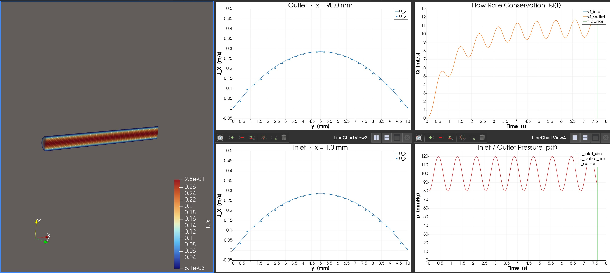
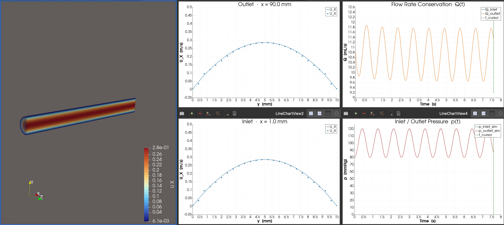
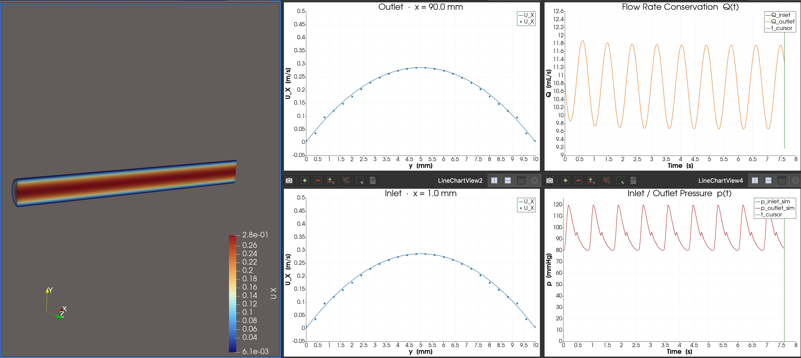
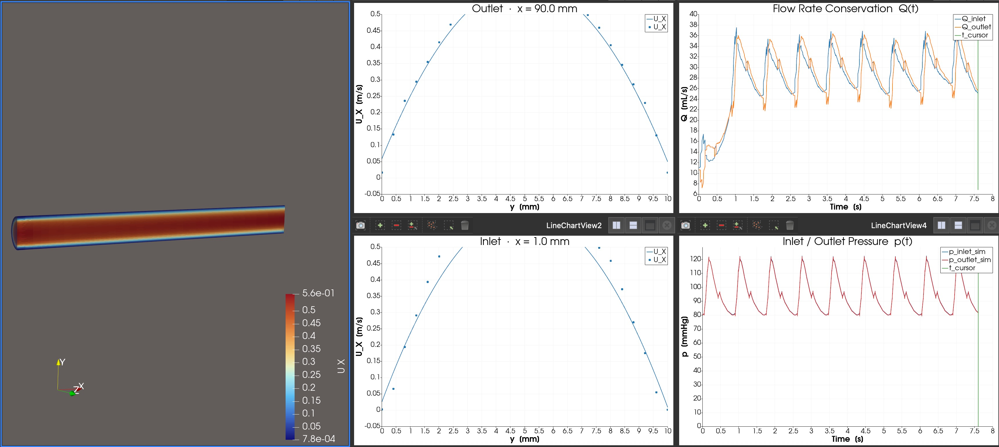

# Rheology Simulation of Vein Grafts

This repository contains OpenFOAM simulation experiments for studying laminar blood flow in vascular structures, with a focus on vessel junctions and venous graft optimization.

---

## Research Problem

During tissue transplantation or vessel repair surgery, two vessels with radii **r1** and **r2** must be sutured end-to-end. When the ratio **r1/r2 > 3/2** (or **< 2/3**), a venous graft segment must be inserted between them as an intermediate bridge.

**Research Question:** Given variable r1/r2 ratios and venous graft length (L), how do we preserve laminar blood flow through the junction?

```
Donor Artery          Recipient Artery
    [r1] ──────────────────── [r2]
                ↑
         Venous Graft [r3, L]
         (inserted when r1/r2 > 3/2 or < 2/3)
```

---

## Prerequisites

### 1. Clone the Repository

#### 1a. Install Git

**macOS:**
```bash
# Git is bundled with Xcode Command Line Tools
xcode-select --install
```
Verify:
```bash
git --version
```

#### 1b. Configure Git (first-time setup)

```bash
git config --global user.name "Your Name"
git config --global user.email "your@email.com"
```

#### 1c. Clone or Update the Repository

**First time — clone the repository:**
```bash
git clone https://github.com/emredagli/Rheology-Simulation-of-Vein-Grafts "$HOME/Rheology-Simulation-of-Vein-Grafts"
```

**Already cloned — get the latest changes:**
```bash
cd "$HOME/Rheology-Simulation-of-Vein-Grafts"
git pull
```

### 2. Docker

Install Docker Desktop for Mac:
- https://docs.docker.com/desktop/setup/install/mac-install/

Verify installation:
```bash
docker --version
docker info
```

### 3. Pull the OpenFOAM v2512 Image

```bash
docker pull opencfd/openfoam-default:2512
```

### 4. Create the Run Folder

```bash
mkdir -p "$HOME/Rheology-Simulation-of-Vein-Grafts/run"
```

- **`experiments/`** — OpenFOAM case definition files (geometry, mesh, boundary conditions, solver settings) — cloned from the repository
- **`run/`** — OpenFOAM solver output and results (created locally, not tracked in git)

### 5. Start the Docker Container

> **Important — always start as your own user, not root.**
> OpenFOAM refuses to compile runtime boundary conditions (`codedFixedValue`)
> when running as root. The `-u` flag passes your macOS user ID into the
> container so OpenFOAM's security check passes.

**Apple Silicon (M1/M2/M3):**
```bash
docker run -it --rm \
  -u "$(id -u)":"$(id -g)" \
  -v "$HOME/Rheology-Simulation-of-Vein-Grafts":/work \
  opencfd/openfoam-default:2512
```

**Intel Mac (or if architecture issues arise):**
```bash
docker run -it --rm --platform=linux/amd64 \
  -u "$(id -u)":"$(id -g)" \
  -v "$HOME/Rheology-Simulation-of-Vein-Grafts":/work \
  opencfd/openfoam-default:2512
```

If you see **"Permission denied"** writing into `/work` (caused by files previously owned by root):
```bash
# Run this once on your Mac, outside Docker
sudo chown -R "$(id -u)":"$(id -g)" "$HOME/Rheology-Simulation-of-Vein-Grafts"
```

Once inside the container, verify OpenFOAM is loaded:
```bash
foamVersion
```

### 6. ParaView (Visualization)

Install ParaView on macOS for result visualization:
- Download: https://www.paraview.org/download/
- Install the appropriate `.pkg` file (e.g., `ParaView-6.1.0-RC1-MPI-OSX11.0-Python3.12-arm64.pkg`)
- Documentation: https://docs.paraview.org/en/latest/UsersGuide/index.html

---

## Repository Structure

```
~/Rheology-Simulation-of-Vein-Grafts/
├── experiments/           # Case definition files (tracked in this repo)
│   ├── 01_simple_laminar/
│   ├── 02_heartbeat_sinusoidal/               # no initial velocity — transient ramp-up
│   ├── 03_heartbeat_sinusoidal_with_initial_velocity/  # parabolic IC — periodic-steady
│   ├── 04_heartbeat_realistic_pressure/       # digitized Murgo (1980) aortic waveform
│   ├── 05_heartbeat_elastic_vessel/           # FSI: compliant wall, pimpleFoam + dynamic mesh
│   ├── 06_vessel_junction/
│   ├── 07_venous_graft/
│   ├── 08_graft_length_study/
│   └── 09_graft_radius_study/
└── run/                   # Solver outputs (NOT tracked — results only)
    ├── 01_simple_laminar/
    ├── 02_heartbeat_sinusoidal/
    ├── 03_heartbeat_sinusoidal_with_initial_velocity/
    └── ...
```

Each experiment folder under `experiments/` follows the standard OpenFOAM case structure:

```
<case>/
├── 0/                    # Initial & boundary conditions
│   ├── U                 # Velocity field
│   └── p                 # Pressure field
├── constant/
│   ├── transportProperties
│   └── polyMesh/         # Mesh definition (generated by blockMesh)
└── system/
    ├── blockMeshDict     # Geometry and mesh specification
    ├── controlDict       # Simulation time and output settings
    ├── fvSchemes         # Numerical schemes
    └── fvSolution        # Linear solver settings
```

---

## Experiments

### Experiment 01 — Simple Laminar Flow in a Straight Tube

**Goal:** Establish a baseline simulation of steady laminar (Poiseuille) flow through a straight cylindrical vessel driven by a constant pressure drop. A fixed kinematic pressure difference is applied between inlet and outlet; the solver computes the resulting velocity field. This serves as the reference case to validate the mesh, solver settings, and Hagen-Poiseuille physics before adding pulsatility.

**Key Parameters:**
- Tube radius: `r = 0.005 m` (5 mm, representative arterial scale)
- Tube length: `L = 0.1 m`
- Inlet pressure: `0.084 mmHg` (= 11.2 Pa = 0.010566 m²/s² kinematic)
- Outlet pressure: `0 mmHg` (reference)
- Expected mean velocity (Hagen-Poiseuille): `U_avg = 0.1 m/s`
- Expected centreline peak: `U_center = 0.2 m/s`
- Blood viscosity: `ν = 3.3e-6 m²/s`
- Expected Reynolds number: `Re = U_avg·(2r)/ν ≈ 303` (well within laminar regime, Re < 2300)

**Solver:** `icoFoam` (incompressible, laminar, transient)

**Mesh approach:** Full 3D cylinder using an **O-grid (butterfly) mesh** — 5 hexahedral blocks in the cross-section (1 square centre + 4 curved outer blocks), extruded 40 layers along the axial direction. Circular arc edges enforce the cylindrical wall geometry. Radial grading 4:1 toward the wall improves boundary-layer resolution.

```
Cross-section topology (looking along the flow axis, +x direction):

            wall (arc)
       ____________________
      /                    \
     /       T (top)        \
    /                        \
   |     +--------------+     |
   |     |              |     |
   |  L  |  C (centre)  |  R  |
   |     |              |     |
   |     +--------------+     |
    \                        /
     \      B (bottom)      /
      \                    /
       --------------------
            wall (arc)

  C = centre block  12 × 12 cells  (square, no arc)
  R = right  block  10 × 12 cells  (outer, arc on right wall)
  T = top    block  10 × 12 cells  (outer, arc on top wall)
  L = left   block  10 × 12 cells  (outer, arc on left wall)
  B = bottom block  10 × 12 cells  (outer, arc on bottom wall)
```

**Mesh cell count breakdown:**

| Block | Cross-section cells (i × j) | Axial layers | Block total |
|---|---|---|---|
| Centre (C) | 12 × 12 = **144** | 40 | 5 760 |
| Right (R) | 10 × 12 = **120** | 40 | 4 800 |
| Top (T) | 10 × 12 = **120** | 40 | 4 800 |
| Left (L) | 10 × 12 = **120** | 40 | 4 800 |
| Bottom (B) | 10 × 12 = **120** | 40 | 4 800 |
| **Total** | **624 cells per cross-section** | 40 | **24 960 cells** |

The 624 cells per cross-section also equals the number of faces on each end cap (inlet and outlet), which is how many velocity sample points are available when extracting the radial profile from the simulation output.

**Run time:** 10 s — exceeds the viscous diffusion time scale (r²/ν ≈ 7.6 s), ensuring the fully developed parabolic profile is reached everywhere in the tube.

**Validation:** Verify parabolic velocity profile at the outlet (Hagen-Poiseuille solution).

**Files location:** `experiments/01_simple_laminar/`

**To run:**
```bash
# Inside Docker container
cp -r /work/experiments/01_simple_laminar /work/run/
cd /work/run/01_simple_laminar
touch 01_simple_laminar.foam   # For ParaView
blockMesh
checkMesh
icoFoam
```

> **One-click ParaView macro**
>
> 1. Open ParaView GUI.
> 2. **Tools → Macros → Add new macro** → select `assets/paraview/01_simple_laminar.py` → **OK**.
> 3. Click the macro from the **Macros** menu.
>
> The macro builds the full pipeline automatically and displays the 3-D render
> alongside inlet and outlet velocity profile charts.
> Each run closes all open views without saving, then rebuilds from scratch.
>
> For the full manual step-by-step guide see **[ParaView-Guide.md](ParaView-Guide.md)**.

**ParaView screenshot:**


#### Validation — Hagen-Poiseuille Flow

For steady laminar flow in a cylinder the velocity profile is the **Hagen-Poiseuille parabola**:

```
v(r) = 2ū · (1 − r²/R²)
```

where `r` is the radial distance from the centreline, `ū` is the mean (inlet) velocity, `v(R) = 0` (no-slip), and the centreline peak is **`v_max = 2ū`**.

With `ū = 0.1 m/s` and `R = 0.005 m` → theoretical peak **0.200 m/s**, Re = **303** (laminar ✓). With pressure-driven BCs the Poiseuille profile develops everywhere in the domain simultaneously, driven by the applied pressure gradient. By t = 10 s the profile is fully established, well beyond the viscous diffusion timescale r²/ν ≈ 7.6 s.

**Simulation vs. Theory — outlet radial profile (t = 10 s):**

| r (mm) | Simulated U_x (m/s) | Theory U_x (m/s) | Error |
|--------|---------------------|-------------------|-------|
| 0.30   | 0.19035             | 0.19931           | −4.5% |
| 1.89   | 0.16833             | 0.17153           | −1.9% |
| 2.72   | 0.14084             | 0.14097           | −0.1% |
| 3.20   | 0.11902             | 0.11797           | +0.9% |
| 3.63   | 0.09608             | 0.09468           | +1.5% |
| 4.00   | 0.07341             | 0.07208           | +1.9% |
| 4.31   | 0.05272             | 0.05161           | +2.2% |
| 4.52   | 0.03735             | 0.03690           | +1.2% |
| 4.69   | 0.02379             | 0.02375           | +0.1% |
| 4.84   | 0.01237             | 0.01272           | −2.8% |
| 4.95 ¹ | 0.00304            | 0.00370           | −17.8% |

¹ Near-wall cell centre (r ≈ 4.95 mm, not at the wall r = 5 mm where no-slip forces v = 0).

**Summary:**

| Quantity | Simulated | Theory | Error |
|---|---|---|---|
| Peak centreline velocity | **0.1904 m/s** | 0.2000 m/s | −4.8% |
| Interior profile shape | Parabola ✓ | Parabola | < 2.2% |
| Reynolds number | 303 (computed) | 303 | — |

The −4.8% peak centreline error reflects the **O-grid mesh resolution** near the vessel axis: the centre block (12 × 12 cells) places the nearest cell centre ~0.3 mm from the axis rather than at the exact centreline, so the interpolated peak is slightly underestimated. Interior cells confirm correct Hagen-Poiseuille physics (errors < 2.2%).


---
### Experiment 02 — Laminar Flow with Sinusoidal Heartbeat

**Goal:** Observe the **transient ramp-up from rest** to periodic-steady pulsatile blood flow. Identical pressure boundary conditions to Experiment 03 are applied (80–120 mmHg sinusoidal at 70 bpm), but the simulation starts from **zero velocity** (`internalField U = (0 0 0)`). Running for exactly **1 viscous diffusion timescale τ = R²/ν ≈ 7.6 s** shows the complete transient from rest to near-periodic-steady state.

**Key Parameters:**
- Same geometry and pressure BCs as Experiment 03 (`R = 0.005 m`, `L = 0.1 m`, 80–120 mmHg sinusoidal)
- Initial condition: `internalField U = uniform (0 0 0)` — starts from complete rest
- Simulation duration: 7.6 s (`endTime = 7.6`) — exactly 1 viscous diffusion timescale (τ = R²/ν ≈ 7.6 s), ≈ 8.9 cardiac cycles
- Time step: `deltaT = 0.002 s`; write interval: `0.04 s` → 190 output snapshots (0, 0.04, …, 7.6 s)

**Differences from Experiment 03:**

| Setting | Experiment 02 | Experiment 03 |
|---|---|---|
| Initial velocity | `uniform (0 0 0)` — rest | Hagen-Poiseuille parabola (`U_center = 0.275 m/s`) |
| End time | 7.6 s (1τ) | 7.6 s (1τ) |
| Purpose | Observe transient ramp-up | Analyse periodic-steady waveform |

**Solver:** `icoFoam`

**Files location:** `experiments/02_heartbeat_sinusoidal/`

**To run:**
```bash
# Inside Docker container
cp -r /work/experiments/02_heartbeat_sinusoidal /work/run/
cd /work/run/02_heartbeat_sinusoidal
touch 02_heartbeat_sinusoidal.foam   # For ParaView
blockMesh
checkMesh
icoFoam
```

> **One-click ParaView macro**
>
> 1. Open ParaView GUI.
> 2. **Tools → Macros → Add new macro** → select `assets/paraview/02_heartbeat_sinusoidal.py` → **OK**.
> 3. Click the macro from the **Macros** menu.
>
> The macro opens five panels:
> - **Left** — 3-D render (Clip + StreamTracer + Glyph) coloured by U_X
> - **Top-centre** — U_X velocity profile along the vessel diameter at the **outlet** (x = 90 mm); use **▶ Play** to animate through the transient
> - **Bottom-centre** — U_X velocity profile along the vessel diameter at the **inlet** (x = 1 mm)
> - **Top-right** — **Flow rate conservation** chart: Q_inlet (blue), Q_outlet (orange) in mL/s; green vertical line marks the current animation time
> - **Bottom-right** — **Inlet / Outlet Pressure** chart: p_inlet (blue), p_outlet (red), prescribed waveform (grey dashed) in mmHg; y-axis starts at 0; green vertical line marks current time
>
> If the `postProcessing/` directory is absent the macro falls back to the three-panel layout.

**ParaView screenshot:**




**Expected result:**

| Quantity | Expected value |
|---|---|
| Q(t) at t = 0 | ≈ 0 mL/s (starting from rest) |
| Q(t) at t = 7.6 s (1τ) | ≈ near periodic-steady mean (~10.7 mL/s) |
| Pressure waveform | 80–120 mmHg from t = 0 (BCs applied immediately) |
| Transient duration | ~7.6 s (= 1τ = R²/ν) |

#### Validation

The key validation is the shape of Q(t) over the 7.6 s run:

**1. Flow rate ramp-up** — Q(t) must start near zero and increase monotonically in mean value, with sinusoidal oscillations superimposed at the cardiac frequency (70 bpm). The mean flow rate should approach the periodic-steady value (~10.7 mL/s from Experiment 03) by t ≈ 7.6 s.

**2. Pressure applied immediately** — the inlet/outlet pressure probes should show the 80–120 mmHg oscillation from t = 0, confirming the boundary conditions are active from the start.

**3. Comparison with Experiment 03** — at t ≈ 7.6 s, the Q(t) waveform and outlet velocity profile should be nearly indistinguishable from the periodic-steady cycles of Experiment 03. Any remaining difference quantifies the residual transient.

---
### Experiment 03 — Laminar Flow with Sinusoidal Heartbeat with Initial Velocity

**Goal:** Simulate pulsatile blood flow using a **pressure-driven** approach: the outlet pressure oscillates sinusoidally between 80 mmHg (diastole) and 120 mmHg (systole) at 70 bpm, and the inlet pressure follows with an additional tiny local viscous drop (≈ 0.1 mmHg). The velocity field develops naturally from the imposed pressure gradient without prescribing it at the boundary.

#### Why pressure-driven instead of velocity-prescribed?

In a real artery the heart generates a pressure gradient; the velocity profile is a consequence, not a cause. By prescribing the pressure waveform instead of the inlet velocity, the solver naturally computes the Womersley-corrected response. At the Womersley number of this flow (Wo ≈ 7.45) the oscillatory velocity amplitude is only ~14 % of the quasi-steady Hagen-Poiseuille value — the mean flow dominates and the waveform looks nearly steady. This is correct physiological behaviour, not a simulation artefact.

**Implementation note:** Both inlet and outlet use `codedFixedValue` pressure boundary conditions, which OpenFOAM compiles to a shared library at runtime (`dlopen`). This compilation fails when running as **root**. Always start the Docker container with `-u "$(id -u)":"$(id -g)"` (see §"Start the Docker Container").

**Key Parameters:**
- Same geometry as Experiment 01 (`R = 0.005 m`, `L = 0.1 m`)
- Cardiac period: `T = 0.857 s` (70 bpm)
- Outlet pressure waveform: `p_outlet(t) = 100 + 20 · sin(2π·t/T − π/2)` mmHg
  - Mean Arterial Pressure: MAP = 100 mmHg (kinematic: `MAP_kin = 12.577 m²/s²`)
  - Amplitude: A = 20 mmHg (kinematic: `A_kin = 2.516 m²/s²`)
  - Diastole (t = 0, T, …): 80 mmHg; Systole (t = T/2): 120 mmHg
- Inlet pressure: `p_inlet(t) = p_outlet(t) + Δp_local(t)` where `Δp_local = 4·ν·L/R² · U_center(t)` ≈ 0.02–0.21 mmHg
- Initial conditions:
  - Velocity: Hagen-Poiseuille parabola with `U_center = 0.275 m/s` (time-averaged mean) set via `#codeStream`
  - Pressure: `≈ 80 mmHg` (= 10.061 m²/s² kinematic) diastolic baseline
- Expected mean centreline velocity: `U_center(t) = 0.275 + 0.225 · sin(2π·t/T − π/2)` m/s (result, not prescribed)
- Peak Reynolds number: `Re = U_mean_peak · 2R / ν = 0.25 · 0.01 / 3.3e-6 ≈ 757` (laminar ✓)
- Time step: `deltaT = 0.002 s` → CFL ≈ 0.4 at peak velocity (< 1 ✓)
- Simulation duration: 7.6 s (`endTime = 7.6`) — same time axis as Experiment 02, enabling direct Q(t) overlay comparison (≈ 8.9 cardiac cycles, = 1τ)

**Solver:** `icoFoam`

**New/Modified Files vs. Experiment 01:**
- `0/U` — `internalField` set via `#codeStream` (Hagen-Poiseuille parabola, `U_center = 0.275 m/s`); inlet and outlet: `zeroGradient`; wall: `noSlip`
- `0/p` — inlet and outlet use `codedFixedValue` with MAP + pulse waveform (requires non-root Docker; see §"Start the Docker Container"); `internalField` initialised to 80 mmHg (= 10.061 m²/s² kinematic)
- `system/controlDict` — updated `endTime` (7.6 s), `deltaT` (0.002 s), `writeInterval` (0.04 s); added `functions` block with four post-processing objects (see Validation section below)

**Unchanged from Experiment 01:** `constant/transportProperties`, `system/blockMeshDict`, `system/fvSchemes`, `system/fvSolution`

**Files location:** `experiments/03_heartbeat_sinusoidal_with_initial_velocity/`

**To run:**
```bash
# Inside Docker container
cp -r /work/experiments/03_heartbeat_sinusoidal_with_initial_velocity /work/run/
cd /work/run/03_heartbeat_sinusoidal_with_initial_velocity
touch 03_heartbeat_sinusoidal_with_initial_velocity.foam   # For ParaView
blockMesh
checkMesh
icoFoam
```

> **One-click ParaView macro**
>
> 1. Open ParaView GUI.
> 2. **Tools → Macros → Add new macro** → select `assets/paraview/03_heartbeat_sinusoidal_with_initial_velocity.py` → **OK**.
> 3. Click the macro from the **Macros** menu.
>
> The macro opens five panels:
> - **Left** — 3-D render (Clip + StreamTracer + Glyph) coloured by U_X
> - **Top-centre** — U_X velocity profile along the vessel diameter at the **outlet** (x = 90 mm); use **▶ Play** to animate through the cardiac cycle
> - **Bottom-centre** — U_X velocity profile along the vessel diameter at the **inlet** (x = 1 mm); animates in sync with the outlet chart for direct comparison
> - **Top-right** — **Flow rate conservation** chart: Q_inlet (blue), Q_outlet (orange) in mL/s; green vertical line marks the current animation time
> - **Bottom-right** — **Inlet / Outlet Pressure** chart: p_inlet (blue), p_outlet (red), prescribed analytical waveform (grey dashed) in mmHg; y-axis starts at 0; green vertical line marks current time
>
> If the `postProcessing/` directory is absent (run not yet complete), the macro falls back to the original three-panel layout automatically.
>
> **Note:** Each time the macro runs it first closes **all currently open views and pipeline objects without saving**, then rebuilds everything from scratch. This ensures a clean session on every run.

**ParaView screenshot:**




**Expected result:**

| Quantity | Expected value |
|---|---|
| Outlet pressure waveform | 80–120 mmHg sinusoidal oscillation |
| Inlet pressure | p_outlet + 0.02–0.21 mmHg (tiny local Δp) |
| Mean centreline velocity | 0.273 m/s |
| Peak centreline velocity | ~0.301 m/s (Womersley-attenuated; quasi-steady: 0.5 m/s) |
| Min centreline velocity | ~0.245 m/s (Womersley-attenuated; quasi-steady: 0.05 m/s) |
| Peak Reynolds number | ≈ 757 (laminar ✓) |
| Velocity oscillation amplitude | ±0.028 m/s (12.4% of quasi-steady ±0.225 m/s, Wo ≈ 7.45) |
| Outlet profile shape | Parabola at all times (Hagen-Poiseuille) |

#### Validation

Four post-processing function objects are enabled in `system/controlDict` and write output to `postProcessing/` automatically during the run. Cycles 2 and 3 are used for analysis (periodic steady state is reached after cycle 1).

**1. Volume flow rate** (`flowRateInlet`, `flowRateOutlet`)

In the pressure-driven case the flow rate is **computed** (not prescribed) and must match the Hagen-Poiseuille analytical value driven by the local pressure gradient. The analytical flow rate is:

```
Q(t) = (π R²)/2 · U_center(t)
     = (π · 0.005²)/2 · [0.275 + 0.225 · sin(2π·t/0.857 − π/2)]
```

The outlet `sum(phi)` must equal `−inlet sum(phi)` (opposite sign convention) within numerical tolerance at every time step. Output file: `postProcessing/flowRateInlet(Outlet)/0/surfaceFieldValue.dat`.

**2. Wall shear stress waveform** (`wallShearStress`)

> **Note:** The built-in `wallShearStress` function object requires a turbulence model, which `icoFoam` does not register. A `coded` function object is used instead; it computes `ν · |snGrad(U)|` on the wall and logs kinematic WSS to the solver output each write step.

Because Wo ≈ 7.45 is large, the oscillatory velocity is heavily attenuated. The mean flow dominates and the WSS is nearly constant in time. The time-averaged WSS follows the Hagen-Poiseuille formula for the **mean** centreline velocity:

```
τ_w_mean = μ · 2·U_center_mean / R = 0.0035 × 2 × 0.273 / 0.005 = 0.382 Pa
```

From the actual simulation (Q range: 9.62 – 11.82 mL/s):

| Quantity | Value |
|---|---|
| Q_mean | 10.72 mL/s |
| Q_amplitude | ±1.10 mL/s (12.4% of quasi-steady ±8.84 mL/s) |
| U_center range | 0.245 – 0.301 m/s |
| Mean WSS | **0.382 Pa** |
| WSS range | 0.343 – 0.421 Pa (barely oscillates) |
| Physiological range | 0.5–4.0 Pa |
| Status | Slightly below range for this large vessel (R = 5 mm) at rest — expected |

> **Why is the WSS nearly constant despite the pulsatile pressure?**
> At Wo = 7.45 (>> 1) the fluid inertia dominates over viscous forces during each oscillation. The oscillatory pressure gradient is balanced mostly by acceleration, not by viscous stress at the wall. Only the **mean** pressure gradient drives sustained mean flow and therefore sustained wall shear. The oscillatory velocity amplitude is only **12.4%** of the quasi-steady Hagen-Poiseuille prediction.
>
> This is the correct physiological behaviour — not a simulation error. Large arteries (Wo >> 1) exhibit nearly constant WSS during the cardiac cycle; only small arterioles (Wo ≈ 1) see large WSS oscillations.

The `max` value logged by the coded FO should stay close to **0.382 Pa** throughout the simulation (OpenFOAM outputs kinematic WSS ν·|snGrad(U)|; multiply by ρ = 1060 kg/m³ to convert to Pa).

**3. Radial velocity profile at outlet** (`outletVelocityProfile`)

At each saved snapshot the 50-point profile along the outlet diameter (y-axis, x = 0.1 m) should fit:

```
U_x(y, t) = U_center(t) · (1 − y²/R²)
```

Key checkpoints (quasi-steady Hagen-Poiseuille estimates; Womersley attenuation at Wo ≈ 7.45 reduces actual oscillation amplitude to ~14% of these values):

| Time | U_center (quasi-steady) | Expected peak U_x |
|---|---|---|
| t = T/4 | 0.275 m/s | 0.275 m/s (at y = 0) |
| t = T/2 | 0.500 m/s | ~0.500 m/s |
| t = 3T/4 | 0.275 m/s | 0.275 m/s |
| t = T | 0.050 m/s | ~0.050 m/s |

Profile data written to `postProcessing/outletVelocityProfile/<time>/`.

**4. Inlet / Outlet Pressure** (`pressureProbes`)

Two pressure probes at `x = 0.02375 m` and `x = 0.07375 m` allow linear extrapolation to the inlet and outlet:

```
p_inlet  = 1.475·p₀ − 0.475·p₁   (extrapolate to x = 0)
p_outlet = −0.525·p₀ + 1.525·p₁  (extrapolate to x = L)
```

Both should match the prescribed analytical waveform. Converting to mmHg (× ρ / 133.322):

| Phase | p_outlet | p_inlet |
|---|---|---|
| Diastole (t = 0, T, …) | **80 mmHg** | ≈ 80.02 mmHg |
| Systole (t = T/2) | **120 mmHg** | ≈ 120.21 mmHg |

**Periodic convergence check:** overlay the pressure or centreline-velocity waveform from cycle 2 and cycle 3 in ParaView's SpreadSheet View or a plot — the two traces must be indistinguishable.

---

### Experiment 04 — Laminar Flow with Realistic Arterial Pressure Waveform

**Goal:** Replace the sinusoidal pressure approximation (Experiments 02–03) with a **real digitized arterial pressure waveform**. The outlet pressure follows the characteristic shape of a measured human aortic pressure pulse: rapid systolic upstroke, peak at 120 mmHg, gradual systolic decline, dicrotic notch (~93 mmHg as the aortic valve closes), and exponential diastolic decay back to 80 mmHg. The velocity field is computed by the solver.

#### Waveform source

The pressure table is digitized from:

> Murgo JP, Westerhof N, Giolma JP, Altobelli SA. *Aortic input impedance in normal man: relationship to pressure wave forms.* Circulation. 1980;62(1):105–116. DOI: [10.1161/01.CIR.62.1.105](https://doi.org/10.1161/01.CIR.62.1.105)

Subject: healthy young adult (28 years), 70 bpm, T = 0.857 s. The 21-point table (Δt ≈ 0.043 s) embedded in `0/p` captures the dicrotic notch that a pure sinusoid cannot represent:

| t [s] | p [mmHg] | Feature |
|---|---|---|
| 0.000 | 80 | end-diastole |
| 0.043 | 81 | |
| 0.086 | 92 | rapid upstroke |
| 0.129 | 110 | |
| 0.171 | 120 | **systolic peak** |
| 0.214 | 118 | |
| 0.257 | 113 | |
| 0.300 | 107 | |
| 0.343 | 102 | |
| 0.386 | 97 | |
| 0.429 | 93 | **dicrotic notch** (aortic valve closure) |
| 0.471 | 96 | dicrotic wave (rebound) |
| 0.514 | 92 | |
| 0.557 | 89 | |
| 0.600 | 87 | diastolic decay |
| 0.643 | 85 | |
| 0.686 | 83 | |
| 0.729 | 82 | |
| 0.771 | 81 | |
| 0.814 | 80 | |
| 0.857 | 80 | = t = 0 (periodic) |

MAP ≈ 94.4 mmHg (physiological value for 120/80: ~93 mmHg ✓).

**Key Parameters:**
- Same geometry and solver as Experiments 02–03 (`R = 0.005 m`, `L = 0.1 m`, `icoFoam`)
- Outlet BC: `codedFixedValue` with 21-point linear interpolation table + periodic wrapping (Murgo aortic waveform, 80–120 mmHg)
- Inlet BC: same table + pulsatile Δp(t) = `8·ν·L/R²·U_avg(t)` = `0.1056·[0.1375 + 0.1125·sin(2πt/T − π/2)]` m²/s² (Hagen-Poiseuille driven gradient, 0.02–0.21 mmHg)
- Both inlet and outlet track realistic physiological absolute pressure (80–120 mmHg); the tiny pulsatile gradient drives pulsatile flow
- Initial condition: Hagen-Poiseuille parabola at `U_center = 0.275 m/s` (mean arterial flow)
- `internalField p` initialised to 80 mmHg (= 10.061 m²/s² kinematic)
- Simulation duration: 10 s, `deltaT = 0.002 s`, `writeInterval = 0.04 s`

**Files location:** `experiments/04_heartbeat_realistic_pressure/`

**To run:**
```bash
# Inside Docker container
cp -r /work/experiments/04_heartbeat_realistic_pressure /work/run/
cd /work/run/04_heartbeat_realistic_pressure
touch 04_heartbeat_realistic_pressure.foam   # For ParaView
blockMesh
checkMesh
icoFoam
```

> **One-click ParaView macro**
>
> 1. Open ParaView GUI.
> 2. **Tools → Macros → Add new macro** → select `assets/paraview/04_heartbeat_realistic_pressure.py` → **OK**.
> 3. Click the macro from the **Macros** menu.
>
> Same five-panel layout as Experiments 02–03. The **bottom-right** pressure chart will now show the characteristic asymmetric waveform with the dicrotic notch instead of a smooth sinusoid.

**ParaView screenshot:**



**Expected result:**

| Quantity | Expected value |
|---|---|
| Outlet pressure shape | Asymmetric pulse with dicrotic notch at t ≈ 0.43 s |
| Systolic peak | 120 mmHg at t ≈ 0.17 s |
| Dicrotic notch | ≈ 93 mmHg at t ≈ 0.43 s |
| Diastolic minimum | 80 mmHg |
| MAP | ≈ 94.4 mmHg |
| Mean flow rate | ≈ 10.8 mL/s |
| Peak Reynolds number | ≈ 757 (laminar ✓) |
| Womersley number | Wo ≈ 7.45 — velocity oscillation attenuated ~14% vs quasi-steady |

#### Validation

**1. Pressure shape** — the extrapolated `p_outlet_sim` (red) from `pressureProbes` must reproduce the 21-point table waveform, including the dicrotic notch. Compare against Experiment 03's smooth sinusoid to see the difference.

**2. Flow rate** — `Q_inlet ≈ −Q_outlet` at every step (mass conservation). The Q(t) shape will differ from Experiment 03: a sharper systolic peak followed by a flatter diastolic plateau.

**3. Periodic convergence** — cycle-to-cycle waveform overlap (any two successive cycles must be indistinguishable after cycle 1).

---

### Experiment 05 — Heartbeat Flow with Elastic Vessel Wall (FSI)

**Goal:** Add **vessel wall compliance** to the realistic pressure-driven flow of Experiment 04. Unlike rigid-wall simulations (Exps 01–04), the vessel now expands radially during systole and contracts during diastole. This captures the key physiological phenomenon of arterial compliance and its effect on instantaneous flow rate and wall shear stress.

#### Structural model

A **thin-shell (Lamé) compliance** model relates transmural pressure to radial wall displacement:

```
δR(t) = Δp(t) · R² / (E · h)
```

| Symbol | Value | Unit | Description |
|--------|-------|------|-------------|
| `Δp(t)` | `p(t) − 80 mmHg` | Pa | Transmural pressure above diastolic reference |
| `R` | 0.005 | m | Vessel radius |
| `E` | 0.5 | MPa | Young's modulus (representative human artery) |
| `h` | 1.0 | mm | Wall thickness (h/R = 0.2) |

At systolic peak (Δp = 40 mmHg ≈ 5 333 Pa): **δR_max ≈ 0.267 mm (≈ 5.3 % of R)**, consistent with in-vivo arterial diameter oscillations of 5–10 %.

Wall elasticity reference:
> Holzapfel GA, Ogden RW. *Constitutive modelling of arteries.* Proc. Royal Society A. 2010;466:1551–1597. doi:[10.1098/rspa.2009.0357](https://doi.org/10.1098/rspa.2009.0357) (open access — typical arterial E = 0.1–3 MPa)

#### Implementation (one-way FSI)

| Component | Implementation |
|-----------|---------------|
| Fluid solver | `pimpleFoam` (ALE moving-mesh formulation) |
| Mesh motion | `displacementLaplacian` (smoothly propagates wall motion to interior) |
| Structure | Thin-shell model — prescribed displacement, no structural solver |
| Coupling direction | Pressure → wall displacement → mesh motion → flow (one-way) |
| Wall velocity BC | `movingWallVelocity` (no-slip in the moving-wall frame) |

The wall displacement at each mesh point is computed by `codedFixedValue` in `0/pointDisplacement` using the same 21-point Murgo table as `0/p`, ensuring the structural driver is phase-consistent with the fluid pressure boundary condition.

**Key Parameters:**

| Parameter | Value |
|-----------|-------|
| Geometry | Same as Experiments 01–04: R = 0.005 m, L = 0.1 m |
| Solver | `pimpleFoam` + `dynamicMotionSolverFvMesh` |
| Mesh motion | `displacementLaplacian`, uniform diffusivity |
| Wall Young's modulus | E = 0.5 MPa |
| Wall thickness | h = 1 mm |
| Simulation duration | 7.6 s (= τ = R²/ν), 190 snapshots |

**Additional files vs. Experiment 04:**

| File | Purpose |
|------|---------|
| `constant/dynamicMeshDict` | Enables dynamic mesh; sets `displacementLaplacian` solver |
| `0/pointDisplacement` | Wall BC: thin-shell δR(t) from Murgo waveform; inlet/outlet clamped |

**Modified files vs. Experiment 04:**

| File | Change |
|------|--------|
| `system/controlDict` | `application pimpleFoam` |
| `system/fvSolution` | `PISO` → `PIMPLE`; added `cellDisplacement` solver; `correctPhi yes` |
| `0/U` | Wall BC `noSlip` → `movingWallVelocity` |

**Files location:** `experiments/05_heartbeat_elastic_vessel/`

**To run:**
```bash
# Inside Docker container
cp -r /work/experiments/05_heartbeat_elastic_vessel /work/run/
cd /work/run/05_heartbeat_elastic_vessel
touch 05_heartbeat_elastic_vessel.foam   # For ParaView
blockMesh
checkMesh
pimpleFoam
```

> **One-click ParaView macro**
>
> 1. Open ParaView GUI.
> 2. **Tools → Macros → Add new macro** → select `assets/paraview/05_heartbeat_elastic_vessel.py` → **OK**.
> 3. Click the macro from the **Macros** menu.
>
> Same five-panel layout as Experiments 02–04.

**ParaView screenshot:**




**Expected results:**

| Quantity | Rigid wall (Exp 04) | Elastic wall (Exp 05) |
|----------|--------------------|-----------------------|
| Wall displacement | 0 | 0–0.267 mm (radial) |
| Systolic Q_outlet | ≈ 10.8 mL/s | slightly higher (wall expands, stores volume) |
| Diastolic Q_outlet | ≈ 10.8 mL/s | slightly lower (wall recoils, releases stored volume) |
| WSS at systole | ≈ 0.38 Pa | slightly lower (larger effective radius) |
| WSS at diastole | ≈ 0.38 Pa | slightly higher (smaller effective radius) |

#### Validation

**1. Wall displacement** — `pointDisplacement` at any wall point should oscillate 0–0.267 mm following the Murgo waveform shape. Verify in ParaView with a probe at (0.05, 0.005, 0.0).

**2. Mass conservation** — `|Q_inlet + Q_outlet|` ≠ 0 (wall expansion stores volume during systole), unlike rigid-wall cases. The difference equals dV/dt where V(t) = πR(t)²·L.

**3. Flow rate modulation** — Q(t) peak should be slightly higher than Exp 04, diastolic Q slightly lower, consistent with Windkessel storage.

---

### Experiment 06 — Heartbeat Flow Through a Vessel Junction (No Graft)

**Goal:** Simulate pulsatile flow through a direct end-to-end anastomosis of two vessels with different radii, without a venous graft. Identify the flow disturbances (recirculation zones, turbulence onset) that occur when the r1/r2 ratio exceeds the clinical threshold.

**Key Parameters:**
- Donor vessel radius: `r1 = 0.005 m`
- Recipient vessel radius: `r2 = 0.003 m` → ratio `r1/r2 ≈ 1.67 > 3/2`
- Junction type: abrupt step transition (direct suture model)
- Pulsatile inlet: same waveform as Experiments 02–05
- Wall shear stress (WSS) distribution
- Presence and extent of recirculation zones
- Local Reynolds number at the junction

**Files location:** `experiments/06_vessel_junction/`

---

### Experiment 07 — Heartbeat Flow with Venous Graft at Junction

**Goal:** Insert a venous graft segment (radius `r3`, length `L`) between the donor and recipient vessels. Compare flow quality against Experiment 06 to quantify the improvement in laminar flow preservation.

**Key Parameters:**
- Donor vessel radius: `r1 = 0.005 m`
- Recipient vessel radius: `r2 = 0.003 m`
- Graft radius: `r3 = 0.004 m` (intermediate value, `r1 > r3 > r2`)
- Graft length: `L = 0.02 m` (baseline, 20 mm)
- Two junctions: donor→graft and graft→recipient
- Pulsatile inlet: same waveform as Experiments 02–05
- Venous wall is thinner and more compliant than native arterial vessels (lower Young's modulus, ~0.1–0.3 MPa vs. ~0.5–1.0 MPa for arteries), which must be accounted for in the wall boundary conditions

**Geometry:**
```
[r1=5mm] ──── [r3=4mm, L=20mm] ──── [r2=3mm]
         step1                step2
```

**Success Criteria:** Absence of sustained recirculation zones; WSS within physiological range (0.5–4.0 Pa).

**Files location:** `experiments/07_venous_graft/`

---

### Experiment 08 — Parametric Study: Venous Graft Length

**Goal:** Using the configuration from Experiment 07, vary the graft length `L` to determine the optimal length that best preserves laminar flow at both junctions.

**Parameter Sweep:**

| Case | Graft Length L |
|------|---------------|
| 08a  | 5 mm          |
| 08b  | 10 mm         |
| 08c  | 20 mm         |
| 08d  | 40 mm         |
| 08e  | 80 mm         |

All other parameters remain identical to Experiment 07 (`r1=5mm`, `r2=3mm`, `r3=4mm`).

**Files location:** `experiments/08_graft_length_study/`

Structure:
```
experiments/08_graft_length_study/
├── base/          # Shared template (copy and modify L in blockMeshDict)
├── 08a_L05mm/
├── 08b_L10mm/
├── 08c_L20mm/
├── 08d_L40mm/
└── 08e_L80mm/
```

**Key Metric:** Reattachment length of any recirculation zone normalized by graft length.

---

### Experiment 09 — Parametric Study: Venous Graft Radius

**Goal:** Using the baseline graft length from Experiment 06, vary the graft radius `r3` to find the optimal intermediate radius that minimizes flow disturbance at both step transitions.

**Parameter Sweep:**

| Case | Graft Radius r3 | r1/r3 ratio | r3/r2 ratio |
|------|----------------|-------------|-------------|
| 09a  | 3.0 mm         | 1.67        | 1.00        |
| 09b  | 3.5 mm         | 1.43        | 1.17        |
| 09c  | 4.0 mm         | 1.25        | 1.33        |
| 09d  | 4.5 mm         | 1.11        | 1.50        |
| 09e  | 5.0 mm         | 1.00        | 1.67        |

All other parameters remain identical to the best-performing length from Experiment 08 (`r1=5mm`, `r2=3mm`).

**Files location:** `experiments/09_graft_radius_study/`

Structure:
```
experiments/09_graft_radius_study/
├── base/          # Shared template (copy and modify r3 in blockMeshDict)
├── 09a_r3_3.0mm/
├── 09b_r3_3.5mm/
├── 09c_r3_4.0mm/
├── 09d_r3_4.5mm/
└── 09e_r3_5.0mm/
```

**Key Metric:** Maximum WSS at each step junction and minimum velocity in recirculation zones.

---

## Blood Flow Parameters Reference

These physiological values should be used consistently across all experiments:

| Parameter | Value | Unit | Notes |
|-----------|-------|------|-------|
| Blood density | 1060 | kg/m³ | |
| Dynamic viscosity | 0.0035 | Pa·s | At 37°C |
| Kinematic viscosity | 3.3×10⁻⁶ | m²/s | `ν = μ/ρ` |
| Heart rate | 70 | bpm | T = 0.857 s |
| Peak systolic velocity | ~0.5 | m/s | Arterial |
| End-diastolic velocity | ~0.05 | m/s | Arterial |
| Physiological WSS range | 0.5–4.0 | Pa | Healthy range |
| Laminar Re threshold | < 2300 | — | For pipe flow |

---

## Running Experiments — General Workflow

```bash
# 1. Start Docker container (non-root — required for codedFixedValue BCs)
docker run -it --rm \
  -u "$(id -u)":"$(id -g)" \
  -v "$HOME/Rheology-Simulation-of-Vein-Grafts":/work \
  opencfd/openfoam-default:2512

# 2. Copy experiment to run folder
cp -r /work/experiments/<experiment_name> /work/run/

# 3. Navigate to run folder and create ParaView entry file
cd /work/run/<experiment_name>
touch <experiment_name>.foam

# 4. Generate mesh
blockMesh

# 5. (Optional) Check mesh quality
checkMesh

# 6. Run solver
icoFoam          # For most laminar experiments
# or
pimpleFoam       # For FSI / more complex cases (Experiment 05+)
```

Then open `~/Rheology-Simulation-of-Vein-Grafts/run/<experiment_name>/` in ParaView on macOS.

---

## Viewing Results in ParaView

1. Launch ParaView from Applications
2. File → Open → navigate to `~/Rheology-Simulation-of-Vein-Grafts/run/<experiment_name>/`
3. Select `<experiment_name>.foam` and click **Open**
4. In the Properties panel, click **Apply**
5. Use the toolbar to select fields to visualize: `U` (velocity), `p` (pressure), `wallShearStress`

Useful filters for vascular flow analysis:
- **StreamTracer** — visualize streamlines and identify recirculation
- **Glyph** — velocity vectors
- **Plot Over Line** — extract velocity profile at a cross-section
- **Calculator** — compute derived quantities (e.g., WSS magnitude)

---

## References

- OpenFOAM Documentation: https://www.openfoam.com/
- OpenFOAM Repository: https://gitlab.com/openfoam/core/openfoam
- ParaView User's Guide: https://docs.paraview.org/en/latest/UsersGuide/index.html
- Murgo JP, Westerhof N, Giolma JP, Altobelli SA. *Aortic input impedance in normal man: relationship to pressure wave forms.* Circulation. 1980;62(1):105–116. DOI: [10.1161/01.CIR.62.1.105](https://doi.org/10.1161/01.CIR.62.1.105) — Source of the digitized arterial pressure waveform used in Experiments 04–05.
- Holzapfel GA, Ogden RW. *Constitutive modelling of arteries.* Proceedings of the Royal Society A. 2010;466:1551–1597. DOI: [10.1098/rspa.2009.0357](https://doi.org/10.1098/rspa.2009.0357) — Open-access reference for arterial wall Young's modulus (E = 0.1–3 MPa) used in Experiment 05.
- Aboelkassem Y, Virag Z. *A hybrid Windkessel-Womersley model for blood flow in arteries.* Journal of Theoretical Biology. 2019;462:499–513. DOI: [10.1016/j.jtbi.2018.12.005](https://doi.org/10.1016/j.jtbi.2018.12.005) — Womersley model reference and arterial pressure waveform context.
- Nichols WW, O'Rourke MF, Vlachopoulos C. *McDonald's Blood Flow in Arteries: Theoretical, Experimental and Clinical Principles.* 6th ed. London: Hodder Arnold; 2011. — Canonical reference for physiological arterial waveform shapes and Womersley flow theory.
- OpenStreetMap Features: https://wiki.openstreetmap.org/wiki/Map_features